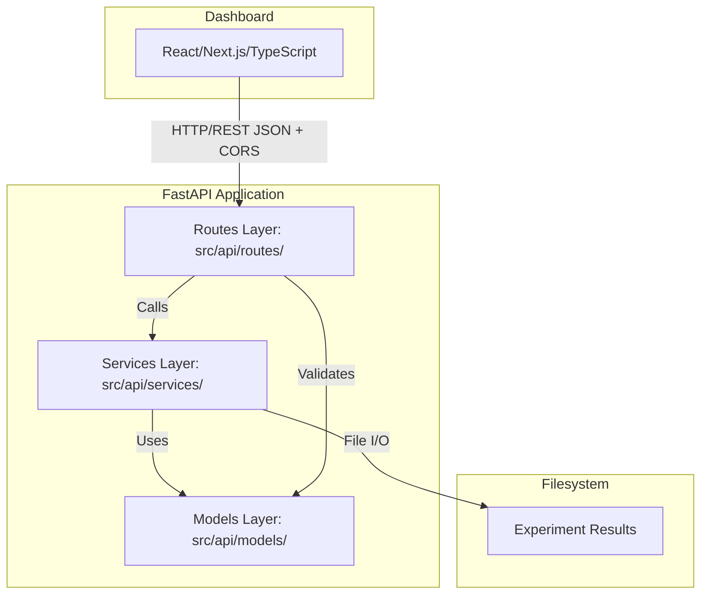
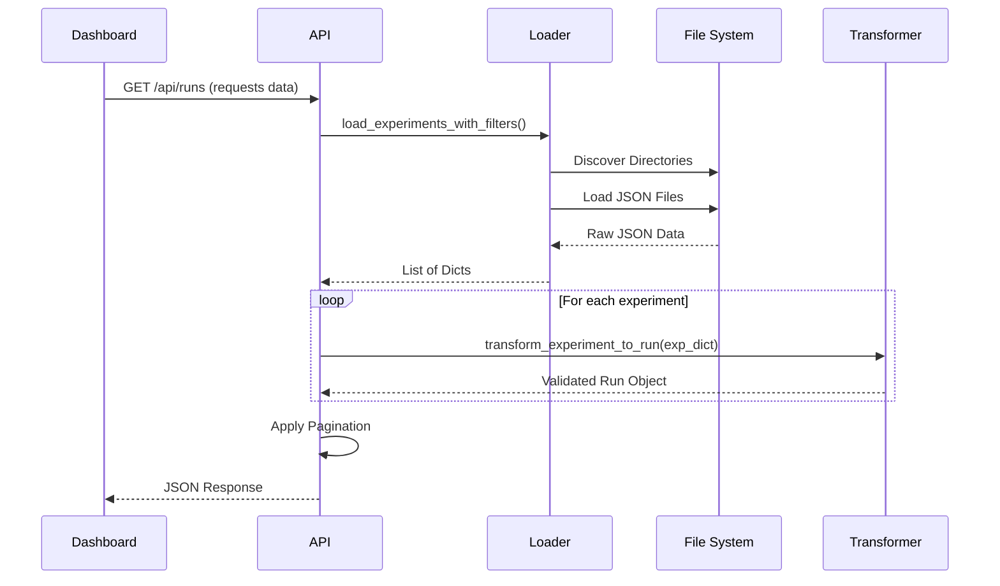

# XAI Evaluation Framework - Integration Summary

**Version**: 0.2.0  
**Last Updated**: 2025-12-25  
**Integration Partner**: XAI Benchmark Dashboard

## Table of Contents

1. [Overview](#overview)
2. [Architecture](#architecture)
3. [API Specifications](#api-specifications)
4. [Data Contracts](#data-contracts)
5. [Integration Points](#integration-points)
6. [Error Handling](#error-handling)
7. [Testing Strategy](#testing-strategy)
8. [Deployment](#deployment)
9. [Monitoring](#monitoring)
10. [Troubleshooting](#troubleshooting)
11. [Maintenance](#maintenance)

---

## Overview

### Purpose

The XAI Evaluation Framework provides a RESTful API that serves experiment
results to the XAI Benchmark Dashboard. The API enables:

- **Data Access**: Retrieve experiment results from filesystem
- **Filtering**: Query experiments by method, dataset, model
- **Pagination**: Handle large result sets efficiently
- **Validation**: Ensure data integrity and consistency
- **CORS Support**: Enable cross-origin requests from dashboard

### Integration Model

```mermaid
graph TD
    Dashboard[Dashboard (Frontend)] -->|HTTP REST API (JSON)| API[FastAPI Server (Backend)]
    API -->|Data Loader| Transformers[Transformer Service]
    Transformers -->|Read| JSON[Experiment Results (JSON Files)]
```

### Key Design Decisions

| Decision | Rationale | Trade-offs |
|----------|-----------|------------|
| RESTful API | Standard, widely supported, stateless | Not real-time |
| JSON format | Human-readable, well-supported | Larger than binary |
| File-based storage | Simple, version-controllable | Limited scalability |
| FastAPI framework | Modern, fast, auto-documentation | Python ecosystem only |
| Pydantic validation | Type safety, auto-validation | Runtime overhead |

---

## Architecture

### System Architecture



### Component Responsibilities

#### Routes Layer
- Define API endpoints
- Handle HTTP requests/responses
- Validate query parameters
- Call service layer
- Return formatted responses
- **Files**: `src/api/routes/health.py`, `src/api/routes/runs.py`

#### Services Layer
- **data_loader.py**: 
  - Discover experiment directories
  - Load JSON files from filesystem
  - Filter experiments by criteria
  - Handle file I/O errors gracefully

- **transformer.py**:
  - Transform raw experiment data to API models
  - Generate unique run IDs
  - Calculate explainability scores
  - Map enum values
  - Validate data structures

#### Models Layer
- Define Pydantic models for validation
- Ensure type safety
- Auto-generate API documentation
- Validate request/response data
- **File**: `src/api/models/schemas.py`

---

## API Specifications

### Base URL

- **Development**: `http://localhost:8000`
- **Production**: `https://api.your-domain.com`

### Endpoints

#### 1. Health Check

**Endpoint**: `GET /api/health`

**Purpose**: Verify API is running and responsive

**Request**: No parameters

**Response** (200 OK):
```json
{
  "status": "healthy",
  "version": "0.2.0",
  "timestamp": "2024-01-15T10:30:00Z"
}
```

**Response Time**: < 100ms

**Use Case**: Dashboard uses this to check connectivity before loading data

---

#### 2. Detailed Health Check

**Endpoint**: `GET /api/health/detailed`

**Purpose**: Get detailed system information

**Request**: No parameters

**Response** (200 OK):
```json
{
  "status": "healthy",
  "version": "0.2.0",
  "timestamp": "2024-01-15T10:30:00Z",
  "system": {
    "experiments_directory": "/path/to/experiments",
    "experiments_directory_exists": true,
    "sample_data_available": true
  }
}
```

---

#### 3. List Runs

**Endpoint**: `GET /api/runs`

**Purpose**: Retrieve list of experiment runs with filtering and pagination

**Query Parameters**:

| Parameter | Type | Required | Default | Description |
|-----------|------|----------|---------|-------------|
| dataset | string | No | None | Filter by dataset name |
| method | string | No | None | Filter by XAI method |
| model_type | string | No | None | Filter by model type |
| model_name | string | No | None | Filter by model name (partial match) |
| limit | integer | No | 20 | Results per page (1-100) |
| offset | integer | No | 0 | Number of results to skip |

**Example Requests**:
```
GET /api/runs
GET /api/runs?method=LIME
GET /api/runs?dataset=AdultIncome&method=SHAP
GET /api/runs?limit=10&offset=20
```

**Response** (200 OK):
```json
{
  "data": [
    {
      "id": "adult_rf_lime_a3b2c1",
      "modelName": "random_forest",
      "modelType": "classical",
      "dataset": "AdultIncome",
      "method": "LIME",
      "accuracy": 85.5,
      "explainabilityScore": 0.87,
      "processingTime": 125.5,
      "status": "completed",
      "timestamp": "2024-01-15T10:30:00Z",
      "metrics": { ... },
      "llmEval": { ... },
      "config": { ... }
    }
  ],
  "pagination": {
    "total": 150,
    "limit": 20,
    "offset": 0,
    "returned": 20,
    "hasNext": true,
    "hasPrev": false
  },
  "metadata": {
    "version": "0.2.0",
    "timestamp": "2024-01-15T10:30:00Z",
    "filters_applied": {
      "method": "LIME"
    }
  }
}
```

**Response Time**: < 2 seconds (depends on data volume)

**Filtering Logic**:
- Multiple filters use AND logic
- Case-insensitive matching
- `model_name` supports partial matching
- Returns empty array if no matches

**Pagination Calculation**:
```python
total = len(all_matching_runs)
start = offset
end = min(offset + limit, total)
returned_runs = all_runs[start:end]
hasNext = end < total
hasPrev = offset > 0
```

---

#### 4. Get Single Run

**Endpoint**: `GET /api/runs/{run_id}`

**Purpose**: Retrieve detailed information for a specific run

**Path Parameters**:
- `run_id`: Unique run identifier (string)

**Example Requests**:
```
GET /api/runs/adult_rf_lime_a3b2c1
```

**Response** (200 OK):
```json
{
  "data": {
    "id": "adult_rf_lime_a3b2c1",
    "modelName": "random_forest",
    ... (complete Run object)
  },
  "metadata": {
    "version": "0.2.0",
    "timestamp": "2024-01-15T10:30:00Z"
  }
}
```

**Response** (404 Not Found):
```json
{
  "detail": "Run not found: adult_rf_lime_xyz",
  "timestamp": "2024-01-15T10:30:00Z"
}
```

**ID Generation**: Deterministic based on model, method, dataset, and timestamp within the transformer service.

---

## Data Contracts

### Run Model (Primary Data Structure)
```python
class Run(BaseModel):
    """Complete experiment run with all metrics and evaluations."""
    
    # Identifiers
    id: str                    # Unique run ID
    
    # Model Information
    modelName: str             # e.g., "random_forest"
    modelType: ModelType       # "classical" | "cnn" | "transformer" | "rnn"
    dataset: Dataset           # e.g., "AdultIncome"
    method: XaiMethod          # "LIME" | "SHAP" | "GradCAM" | "RISE"
    
    # Performance Metrics
    accuracy: float            # 0-100 (percentage)
    explainabilityScore: float # 0-1 (weighted average of metrics)
    
    # Execution Metadata
    processingTime: float      # milliseconds
    status: RunStatus          # "completed" | "failed"
    timestamp: str             # ISO 8601 datetime
    
    # Detailed Metrics
    metrics: MetricSet         # 6 quantitative metrics
    
    # LLM Evaluation
    llmEval: LlmEval          # Likert scores + justification
    
    # Optional Configuration
    config: Optional[Dict[str, Any]] = None
```

### MetricSet (Quantitative Metrics)
```python
class MetricSet(BaseModel):
    """Six core explainability metrics."""
    
    Fidelity: float                    # 0-1: How well explanation matches model
    Stability: float                   # 0-1: Consistency across perturbations
    Sparsity: float                    # 0-1: Simplicity of explanation
    CausalAlignment: float             # 0-1: Alignment with causal relationships
    CounterfactualSensitivity: float   # 0-1: Response to meaningful changes
    EfficiencyMS: float                # >0: Processing time in milliseconds
```

### LLM Evaluation (Qualitative Assessment)
```python
class LlmEval(BaseModel):
    """LLM-based qualitative evaluation."""
    
    Likert: LikertScores       # 5 Likert scale ratings (1-5)
    Justification: str         # 10-1000 characters
    
class LikertScores(BaseModel):
    """Five-point Likert scale ratings."""
    
    clarity: int          # 1-5: How clear is the explanation?
    usefulness: int       # 1-5: How useful for decision-making?
    completeness: int     # 1-5: How complete is the explanation?
    trustworthiness: int  # 1-5: How trustworthy is it?
    overall: int          # 1-5: Overall quality rating
```

### Enumerations
```python
class ModelType(str, Enum):
    CLASSICAL = "classical"
    CNN = "cnn"
    TRANSFORMER = "transformer"
    RNN = "rnn"

class Dataset(str, Enum):
    ADULT_INCOME = "AdultIncome"
    CIFAR_10 = "CIFAR-10"
    MNIST = "MNIST"
    # ... extensible

class XaiMethod(str, Enum):
    LIME = "LIME"
    SHAP = "SHAP"
    GRADCAM = "GradCAM"
    RISE = "RISE"
    # ... extensible

class RunStatus(str, Enum):
    COMPLETED = "completed"
    FAILED = "failed"
```

### Explainability Score Calculation

Weighted average of metrics:
```python
explainability_score = (
    Fidelity * 0.30 +
    Stability * 0.25 +
    Sparsity * 0.20 +
    CausalAlignment * 0.15 +
    CounterfactualSensitivity * 0.10
)
```

**Weights Rationale**:
- **Fidelity (30%)**: Most important - must match model behavior
- **Stability (25%)**: Critical for trust and reliability
- **Sparsity (20%)**: Important for human comprehension
- **Causal Alignment (15%)**: Validates correctness
- **Counterfactual Sensitivity (10%)**: Additional validation

---

## Integration Points

### 1. Data Loading Flow



### 2. CORS Configuration

**Purpose**: Allow dashboard to make cross-origin requests

**Configuration** (`src/api/main.py`):
```python
app.add_middleware(
    CORSMiddleware,
    allow_origins=[
        "http://localhost:3000",      # Dashboard dev server
        "http://127.0.0.1:3000",      # Alternative localhost
        "https://your-domain.com"      # Production dashboard
    ],
    allow_credentials=True,
    allow_methods=["GET", "POST", "PUT", "DELETE"],
    allow_headers=["*"],
)
```

**Important**: Update origins for production deployment

### 3. Error Response Format

**Validation Error** (422):
```json
{
  "detail": [
    {
      "loc": ["query", "limit"],
      "msg": "ensure this value is less than or equal to 100",
      "type": "value_error.number.not_le"
    }
  ]
}
```

**Not Found** (404):
```json
{
  "detail": "Run not found: {run_id}",
  "timestamp": "2024-01-15T10:30:00Z"
}
```

**Server Error** (500):
```json
{
  "detail": "Internal server error",
  "timestamp": "2024-01-15T10:30:00Z"
}
```

---

## Error Handling

### Error Handling Strategy

1. **Graceful Degradation**: Never crash, always return valid response
2. **Informative Messages**: Help users understand what went wrong
3. **Logging**: Log all errors for debugging
4. **Validation**: Validate early (query params, path params)
5. **Recovery**: Continue processing when possible

### Error Scenarios

| Scenario | Status | Response | Behavior |
|----------|--------|----------|----------|
| Invalid query parameter | 422 | Validation error details | Reject request |
| Run not found | 404 | "Run not found" message | Return error |
| File read error | 500 | Generic error message | Log and skip file |
| JSON parse error | 500 | Generic error message | Log and skip file |
| Transform error | 500 | Generic error message | Log and skip item |
| Server exception | 500 | Generic error message | Log full traceback |

### Logging Configuration
```python
logging.basicConfig(
    level=logging.INFO,
    format='%(asctime)s - %(name)s - %(levelname)s - %(message)s'
)
```

**Log Levels**:
- **INFO**: Normal operations (request received, response sent)
- **WARNING**: Expected errors (file not found, skip invalid data)
- **ERROR**: Unexpected errors (exceptions, failures)

---

## Testing Strategy

### Test Pyramid

- **E2E**: Manual visual verification
- **Integration**: API endpoints with real flow
- **Unit**: Individual functions and models

### Unit Tests (60+ tests)

**Location**: `src/api/tests/test_*.py`

**Coverage**:
- Models (`test_models.py`): Pydantic validation
- Transformer (`test_transformer.py`): Data transformation
- Data Loader (`test_data_loader.py`): File loading and filtering
- Health endpoints (`test_health.py`): Health checks
- Main app (`test_main.py`): App configuration

**Run**: `pytest src/api/tests/ -v -m "not integration"`

### Integration Tests (30+ tests)

**Location**: `src/api/tests/test_integration.py`

**Coverage**:
- Complete API request/response flow
- Filtering with real data
- Pagination logic
- Error handling
- CORS headers

**Run**: `pytest src/api/tests/test_integration.py -v`

### End-to-End Tests (Manual)

**Scripts**: `scripts/manual_api_tests.py`

**Coverage**:
- All endpoints with real server
- Performance testing
- Error scenarios
- Browser compatibility

**Run**: `python scripts/manual_api_tests.py`

---

## Deployment

### Development Deployment
```bash
# Start API server
python -m src.api.main

# Should see:
# 🚀 XAI Evaluation API v0.2.0
# 📍 Server: http://0.0.0.0:8000
# 📚 API documentation available at /docs
```

**Configuration**:
- Host: 0.0.0.0 (all interfaces)
- Port: 8000
- Reload: Enabled (auto-restart on code changes)
- CORS: Localhost origins allowed

### Production Deployment

**Recommended Platform**: Railway, Heroku, or cloud VM

**Configuration**:
```bash
# Environment variables
HOST=0.0.0.0
PORT=8000
API_VERSION=0.2.0
CORS_ORIGINS=https://dashboard.your-domain.com

# Start command
uvicorn src.api.main:app --host 0.0.0.0 --port $PORT
```

**Requirements**:
- Python 3.11+
- Dependencies from requirements.txt
- Access to experiments directory
- HTTPS (recommended)

### Docker Deployment (Optional)
```dockerfile
FROM python:3.11-slim

WORKDIR /app

COPY requirements.txt .
RUN pip install --no-cache-dir -r requirements.txt

COPY src/ ./src/
COPY experiments/ ./experiments/

CMD ["uvicorn", "src.api.main:app", "--host", "0.0.0.0", "--port", "8000"]
```

---

## Monitoring

### Health Checks

**Endpoint**: `GET /api/health`

**Monitoring**:
- Uptime monitoring (Uptime Robot, Pingdom)
- Expected response time: <100ms
- Alert if down >1 minute

### Metrics to Monitor

- **Request Rate**: Requests per second
- **Response Time**: p50, p95, p99 latencies
- **Error Rate**: 4xx and 5xx responses
- **Data Volume**: Number of experiments served

### Logging

**Production Logging**:
- Structured logging (JSON format)
- Log aggregation (CloudWatch, Datadog)
- Error tracking (Sentry)
- Request/response logging

---

## Troubleshooting

### Common Issues

#### 1. "API not accessible" / Connection Refused

**Symptoms**: Dashboard can't connect to API

**Checks**:
```bash
# Is server running?
curl http://localhost:8000/api/health

# Check logs for errors
# Verify port 8000 not in use
netstat -an | grep 8000
```

**Solutions**:
- Start API server: `python -m src.api.main`
- Check firewall settings
- Verify correct URL in dashboard config

#### 2. CORS Errors

**Symptoms**: Browser console shows "blocked by CORS policy"

**Checks**:
- Verify dashboard URL in CORS origins
- Check response headers include CORS headers

**Solutions**:
```python
# Update src/api/main.py
allow_origins=["http://localhost:3000"]  # Add dashboard URL
```

#### 3. No Data Returned / Empty Results

**Symptoms**: API returns empty array

**Checks**:
```bash
# Check experiments directory
ls experiments/sample_data/results/*.json

# Test data loader directly
python -c "from src.api.services.data_loader import load_all_experiments; print(len(load_all_experiments()))"
```

**Solutions**:
- Verify experiments directory exists
- Check JSON files are valid
- Review logs for file loading errors

#### 4. 500 Internal Server Error

**Symptoms**: API returns 500 status

**Checks**:
- Check server logs for exceptions
- Verify JSON files are valid
- Check all required fields present

**Solutions**:
- Fix malformed JSON files
- Add missing required fields
- Update transformer for schema changes

#### 5. Slow Response Times

**Symptoms**: Requests take >2 seconds

**Checks**:
- Number of experiments
- File system performance
- Network latency

**Solutions**:
- Implement caching
- Reduce data volume with filters
- Consider database migration
- Enable response compression

### Debug Mode

Enable detailed logging:
```python
# src/api/main.py
logging.basicConfig(level=logging.DEBUG)
```

Includes:
- All requests logged
- Query parameters logged
- File loading details
- Transformation steps

---

## Maintenance

### Regular Maintenance Tasks

#### Weekly
- Check error logs for issues
- Monitor response times
- Verify health check status

#### Monthly
- Update dependencies (`pip list --outdated`)
- Review and clean old logs
- Check disk space (experiments directory)
- Run security audit (`pip audit`)

#### Quarterly
- Review API usage patterns
- Optimize slow endpoints
- Update documentation
- Plan feature enhancements

### Updating Data Models

When experiment output format changes:

1. **Update Pydantic Models** (`src/api/models/schemas.py`)
2. **Update Transformer** (`src/api/services/transformer.py`)
3. **Update Tests** (`src/api/tests/test_*.py`)
4. **Update Sample Data** (`experiments/sample_data/`)
5. **Test Integration** (run full test suite)
6. **Update Documentation** (this file + API docs)
7. **Increment API Version** (`src/api/config.py`)

### Adding New Endpoints

1. **Design Endpoint** (document spec first)
2. **Create Route Handler** (`src/api/routes/`)
3. **Add Service Logic** (`src/api/services/` if needed)
4. **Write Tests** (`src/api/tests/`)
5. **Update OpenAPI Docs** (auto-generated)
6. **Register Router** (`src/api/main.py`)
7. **Update Integration Summary** (this document)

### Scaling Considerations

**When to scale**:
- >1000 experiments
- >100 requests/minute
- Response time >2 seconds
- Multiple concurrent users

**Scaling options**:
1. **Caching**: Redis for transformed data
2. **Database**: PostgreSQL for structured queries
3. **Load Balancing**: Multiple API instances
4. **CDN**: Static content delivery
5. **Async Processing**: Background jobs for heavy operations

---

## Future Enhancements

### Planned Features

1. **Database Integration**
   - Migrate from file-based to PostgreSQL
   - Faster queries and complex filtering
   - Better scalability

2. **Caching Layer**
   - Redis for frequently accessed data
   - Reduce filesystem I/O
   - Improve response times

3. **Real-time Updates**
   - WebSocket support
   - Push updates to dashboard
   - Live experiment status

4. **Advanced Filtering**
   - Date range filtering
   - Metric range queries
   - Full-text search

5. **Batch Operations**
   - Bulk data export
   - Aggregate statistics
   - Comparison endpoints

6. **Authentication**
   - API key management
   - User-based access control
   - Rate limiting per user

### API Versioning Strategy

**Current**: v0.2.0 (implicit in responses)

**Future**:
- Semantic versioning (MAJOR.MINOR.PATCH)
- Version in URL path (`/api/v1/runs`)
- Maintain backward compatibility
- Deprecation warnings for old versions

---

## Appendix

### A. Complete API Reference
See: `http://localhost:8000/docs` (Swagger UI)

### B. Data Model Schemas
See: `src/api/models/schemas.py`

### C. Testing Documentation
See: `docs/testing/INTEGRATION_TESTS.md`

### D. Deployment Guide
See: `docs/DEPLOYMENT.md` (when created)

### E. Changelog
See: `CHANGELOG.md`

---

**Document Maintainer**: Jonathan  
**Last Review**: 2025-12-25  
**Next Review**: 2026-03-25
