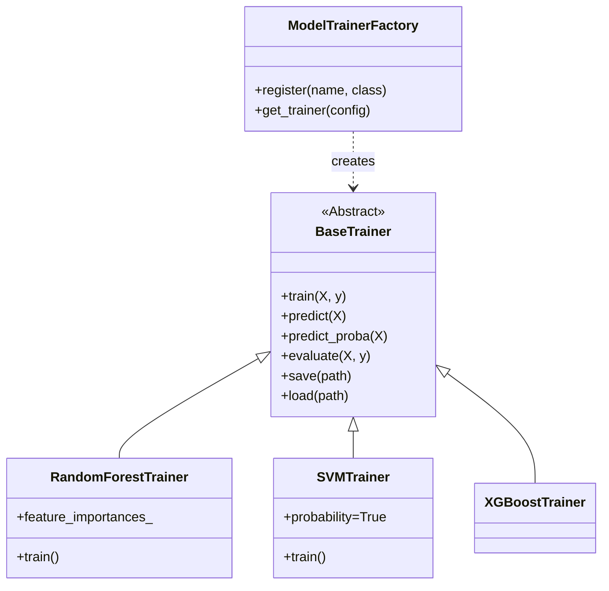

# Technical Specification: Generic Model Trainers & XAI Expansion
**Spec ID**: SPEC-001
**Related ADR**: ADR-0023
**Role**: Architect
**Status**: DRAFT

## 1. Executive Summary
This specification details the implementation of a **Generic Model Training Architecture** to support the comparative evaluation requirements of the thesis (Paper A & Paper B). It moves the system from a specific Random Forest implementation to a polymorphic **Factory Pattern**, enabling support for SVM, MLP, Logistic Regression, and future models (LightGBM).

## 2. Thesis & Publication Alignment
| Objective | Requirement | Architectural Solution |
| :--- | :--- | :--- |
| **Paper A (JMLR)** | "Extensible Framework" | `BaseTrainer` ABC + Registry Pattern allows adding new models without core code changes. |
| **Paper B (FAccT)** | "Robust LIME vs SHAP" | Decoupling explainers (`ExplainerWrapper`) from model internals ensures fair comparison across model types. |
| **Thesis Phase H** | "comparative evaluation" | Standardized `evaluate()` method guarantees consistent metrics (Fidelity, Stability) across all 4 model types. |

## 3. Architecture Design

### 3.1 Class Diagram


### 3.2 File Structure
```
src/
  models/
    __init__.py       # Exposes Factory
    base.py           # BaseTrainer (ABC)
    factory.py        # ModelTrainerFactory
    rf_trainer.py     # Migrated Random Forest
    xgboost_trainer.py# Migrated XGBoost
    sklearn_trainers.py # SVM, MLP, LogisticRegression
```

## 4. Render.com Deployment Constraints
The design must adhere to Render.com's "Free/Starter" tier limits (512MB - 2GB RAM) and ephemeral filesystem.

### 4.1 Memory Management
*   **Constraint**: `tensorflow` (required for DiCE/Alibi) is heavy.
*   **Solution**:
    *   **Lazy Loading**: Do not import `alibi` or `tensorflow` at module level. Import only inside the `AnchorsWrapper.explain()` method.
    *   **CPU-Only**: Force `tensorflow-cpu` in `environment.yml` to save slug size.
    *   **Batching**: `BatchExperimentRunner` must strictly serialise experiments (no parallel processing on single Render instance).

### 4.2 Application State
*   **Constraint**: Filesystem is ephemeral.
*   **Solution**:
    *   `save()` methods must write to `experiments/` (for local development) but the `ExperimentRunner` must be capable of uploading artifacts to S3/Blob Storage (Phase F verified this).
    *   For this phase, we ensure `save()` returns a **Path** object that the orchestration layer can then handle (sync/upload).

## 5. Implementation Details

### 5.1 BaseTrainer Contract
```python
class BaseTrainer(ABC):
    @abstractmethod
    def train(self, X, y, **kwargs):
        """Standard interface for training."""
        pass

    def evaluate(self, X_test, y_test):
        """
        Concrete implementation shared across all models.
        Calculates Accuracy, ROC-AUC, F1 (Weighted).
        """
        # ... standard sklearn metrics ...
        return metrics_dict
```

### 5.2 Factory Registry
```python
class ModelTrainerFactory:
    _registry = {}

    @classmethod
    def register(cls, name, trainer_class):
        cls._registry[name] = trainer_class

    @classmethod
    def get_trainer(cls, config):
        model_type = config.get('model_type', 'rf')
        return cls._registry[model_type](config)
```

## 6. Migration Strategy
1.  **Refactor**: Move `AdultRandomForestTrainer` to `rf_trainer.py` inheriting `BaseTrainer`.
2.  **Shim**: Keep `src/models/tabular_models.py` but make `AdultRandomForestTrainer` a deprecated alias for the new class to prevent breaking changes.
3.  **Expand**: Implement `SVMTrainer` (RBF kernel default) and `MLPTrainer` (Adam, ReLU).

## 7. Verification Steps
1.  **Unit Tests**: Mock data tests for `SVMTrainer` and `MLPTrainer` to ensure they handle the `BaseTrainer` contract (input shapes, output formats).
2.  **Integration**: Run `scripts/test_sample_data.py` with `model_type="svm"` to verify end-to-end flow.
