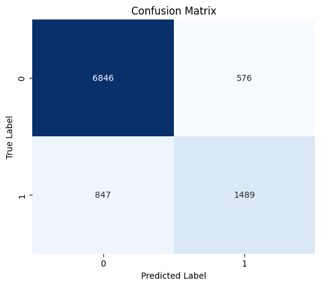
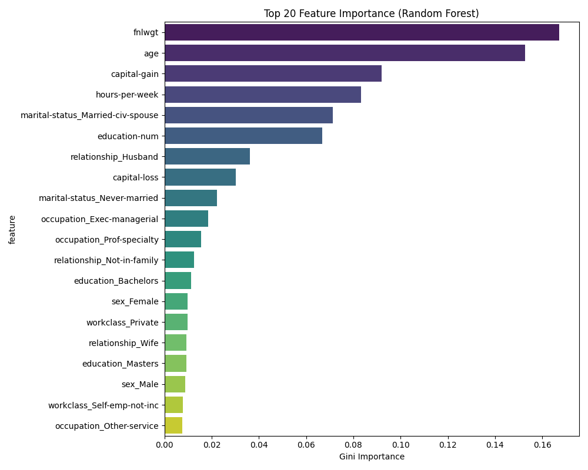
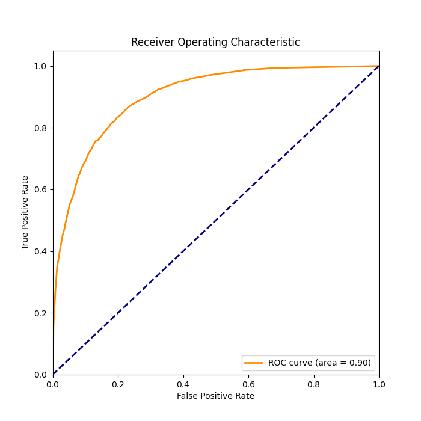

# Random Forest Training Report (Experiment 1)

**Date**: 2025-12-19 22:18:10

## Performance Summary
- **Accuracy**: 0.8542
- **ROC AUC**: 0.9015
- **Execution Time**: 0.6174s

## Visualizations

### Confusion Matrix


### Feature Importance


### ROC Curve


## Model Parameters
```json
{
  "n_estimators": 100,
  "random_state": 42,
  "n_jobs": -1
}
```
