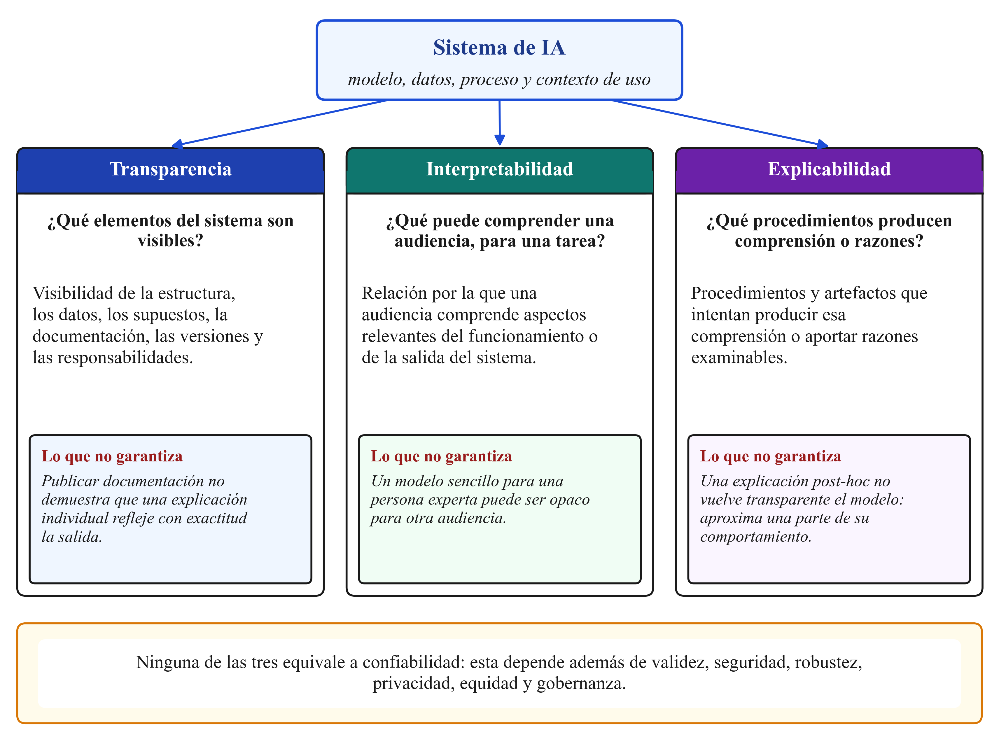
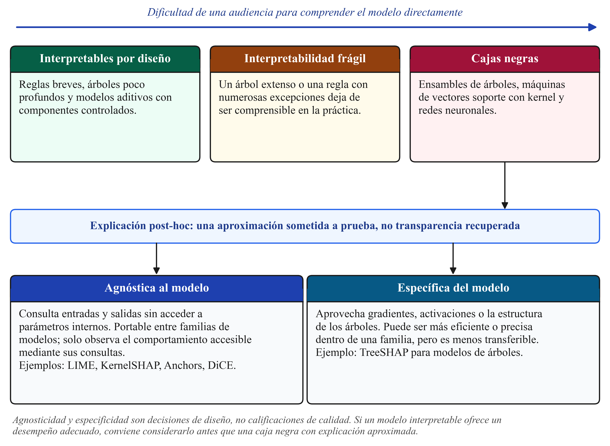
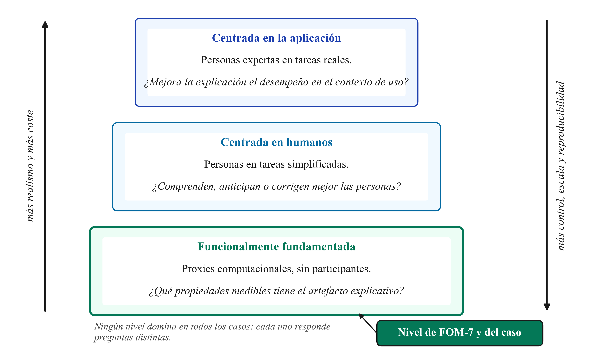

# Qué es y qué no es la inteligencia artificial explicable

## Nociones fundamentales: Transparencia, interpretabilidad y explicabilidad

En las conversaciones técnicas y en la literatura especializada, los términos transparencia, interpretabilidad y explicabilidad suelen utilizarse como sinónimos intercambiables. Sin embargo, para un ingeniero de datos que busca diseñar controles de calidad y auditoría, es fundamental establecer distinciones arquitectónicas precisas:

* **Transparencia:** Es una propiedad sistémica del entorno de ingeniería en el que opera el modelo. Se refiere a la accesibilidad del código fuente, las versiones de los datos de entrenamiento (linaje y esquemas en DVC o Delta Lake), los grafos de ejecución (DAGs en Airflow), la documentación técnica de hiperparámetros y las canalizaciones de validación cruzada (Lipton, 2018). Disponer de un repositorio completamente transparente en Git es una condición necesaria para la auditoría, pero no garantiza que un ingeniero humano pueda anticipar cómo interactúan internamente cientos de variables dentro de un bosque de mil árboles.
* **Interpretabilidad:** Es una cualidad intrínseca del algoritmo que permite a un ser humano comprender de manera pasiva y directa la lógica que vincula las entradas con las salidas (Murdoch *et al.*, 2019). Un modelo es interpretable por construcción si su lógica puede inspeccionarse directamente sin herramientas externas: por ejemplo, una regresión lineal con diez coeficientes o un árbol de decisión de profundidad tres que se traduce directamente en una sentencia SQL con cláusulas `CASE WHEN`. La interpretabilidad depende del observador: una fórmula de Poisson es transparente para un actuario de seguros, pero completamente opaca para un usuario sin formación estadística.
* **Explicabilidad:** Es una propiedad extrínseca y activa. Se refiere a la capacidad de construir procedimientos secundarios, aproximaciones matemáticas o artefactos visuales —como vectores de pesos, reglas booleanas de suficiencia o escenarios contrafactuales— para interpretar a posteriori la decisión emitida por un clasificador que, en sí mismo, es demasiado complejo para ser interpretable directamente (Phillips *et al.*, 2021).

Como se ilustra en la Figura 1, ninguna de estas tres propiedades equivale automáticamente a la **confiabilidad** (*trustworthiness*). Un sistema puede generar una explicación visualmente atractiva o intuitiva y, sin embargo, adolecer de vulnerabilidades críticas: sesgos demográficos ocultos, inestabilidad ante pequeñas variaciones de entrada o violaciones de privacidad en los datos de entrenamiento (Tabassi, 2023).

## La trampa de la ingeniería: Atribución estadística frente a causalidad

Uno de los errores conceptuales más frecuentes y peligrosos en el despliegue de XAI consiste en confundir la **atribución de características** con la **inferencia causal**. 

Cuando una biblioteca de XAI asigna un peso numérico elevado a una columna (por ejemplo, reportando que el atributo *Antigüedad de la Cuenta* aportó $+0.32$ a la probabilidad de aprobación de un crédito), dicho valor describe únicamente cómo el algoritmo utilizó esa columna para minimizar su función de pérdida matemática sobre la muestra de datos disponible. Bajo ninguna circunstancia significa que ejecutar una instrucción de actualización en la base de datos (`UPDATE cuentas SET antiguedad = antiguedad + 3`) producirá en el mundo real un incremento causal en la solvencia del cliente (Pearl, 2009).

Un ejemplo clásico en la literatura médica ilustra este peligro: en un estudio sobre predicción de mortalidad por neumonía, un modelo de alta precisión asignó un menor riesgo de fallecimiento a los pacientes con historial de asma. El motivo real no era biológico, sino operacional: los pacientes asmáticos que presentaban síntomas de neumonía eran derivados de inmediato a la Unidad de Cuidados Intensivos (UCI), recibiendo un tratamiento agresivo que reducía su tasa de mortalidad. El modelo detectó correctamente la correlación estadística en los datos hospitalarios, y un explicador post-hoc reflejaría fielmente que "tener asma reduce el riesgo estimado". Sin embargo, interpretar esa atribución como una prescripción causal clínica —sugiriendo que un médico debería demorar la atención de un paciente asmático con neumonía— resultaría catastrófico. La explicabilidad evalúa la **fidelidad descriptiva del modelo matemático**, no la estructura causal del fenómeno físico.

## Taxonomía de métodos: Intrínsecos frente a Post-hoc

El ecosistema de interpretabilidad se divide en dos grandes enfoques metodológicos:

1. **Modelos intrínsecamente interpretables (*Ante-hoc* o por diseño):** Algoritmos donde la estructura interna es accesible por construcción matemática (regresiones lineales y logísticas regularizadas, árboles de decisión simples, modelos basados en listas de reglas). Su gran ventaja radica en que no requieren aproximaciones secundarias y garantizan una fidelidad absoluta a su propia lógica.
2. **Explicaciones a posteriori (*Post-hoc*):** Técnicas que tratan al clasificador primario como un objeto inmutable ya entrenado y optimizado. Para modelos complejos (redes neuronales convolucionales o densas, ensambles de árboles de decisión en XGBoost o LightGBM), los métodos post-hoc construyen un sustituto local (*surrogate*) que aproxima el comportamiento del clasificador en una región de interés.

Como detalla la Figura 2, los métodos post-hoc se clasifican a su vez en:
* **Específicos del modelo (*Model-specific*):** Métodos que requieren acceso a la arquitectura interna, tales como el cálculo de gradientes respecto a las entradas (Integrated Gradients) o la estructura de ramas y pesos de árboles (TreeSHAP).
* **Agnósticos al modelo (*Model-agnostic*):** Métodos que interactúan con el clasificador estrictamente como una caja negra a través de su interfaz de inferencia ($x \to f(x)$), enviando entradas perturbadas y analizando las salidas resultantes sin asumir ninguna estructura interna particular (Marcinkevičs & Vogt, 2023).

## Alcance operacional: Explicaciones Locales frente a Globales

En la arquitectura de sistemas analíticos, el alcance de la explicación determina la escala espacial a la que aplica la información obtenida:

* **Alcance Local (*Local Interpretability*):** Explica la inferencia para una fila o registro específico. Responde a preguntas operacionales puntuales: *¿Por qué el modelo denegó la transacción #8812 de este cliente en particular?*
* **Alcance Global (*Global Interpretability*):** Intenta resumir la lógica estructural del clasificador a lo largo de toda la distribución poblacional. Responde a preguntas estratégicas: *¿Cuáles son los factores dominantes que determinan las predicciones del modelo en todo el conjunto de clientes?*

Un principio clave de ingeniería: **la suma de explicaciones locales no equivale a una explicación global válida**. Debido a que los modelos complejos definen fronteras de decisión no lineales con curvaturas heterogéneas, promediar linealmente las atribuciones locales de diez mil registros puede enmascarar dinámicas locales contrapuestas y generar conclusiones engañosas.

## Niveles de evaluación científica: La posición de FOM-7

Para evaluar rigurosamente la calidad de una técnica explicativa, Doshi-Velez y Kim (2017) establecieron una taxonomía de tres niveles que ordena los métodos según su grado de intervención humana y costo experimental:

1. **Evaluación basada en la aplicación (*Application-grounded*):** Se realizan experimentos directos en los que especialistas del dominio (por ejemplo, patólogos o analistas de crédito) toman decisiones en su flujo diario de trabajo apoyándose en las explicaciones, evaluando si mejora su tasa de acierto o su velocidad.
2. **Evaluación basada en humanos (*Human-grounded*):** Involucra pruebas de laboratorio con usuarios legos que evalúan tareas abstractas (por ejemplo, elegir entre dos predicciones basándose en la claridad de los gráficos de explicación).
3. **Evaluación funcionalmente fundamentada (*Functionally-grounded*):** Emplea métricas computacionales deterministas y proxies matemáticos objetivos (tales como la fidelidad de reconstrucción, la estabilidad ante ruido gaussiano, la parsimonia de coeficientes y el tiempo de CPU por inferencia) sobre conjuntos de datos estandarizados, sin requerir pruebas subjetivas con usuarios.

Como se destaca en la Figura 4, el protocolo **FOM-7** se ubica formalmente en el nivel de **evaluación funcionalmente fundamentada**. Esta decisión es análoga a la implementación de suites de pruebas unitarias y de integración en ingeniería de software: antes de exponer un producto a pruebas de aceptación con usuarios (*UAT*), el equipo de ingeniería debe garantizar que el componente satisfaga estándares matemáticos mínimos de estabilidad, fidelidad y rendimiento.
