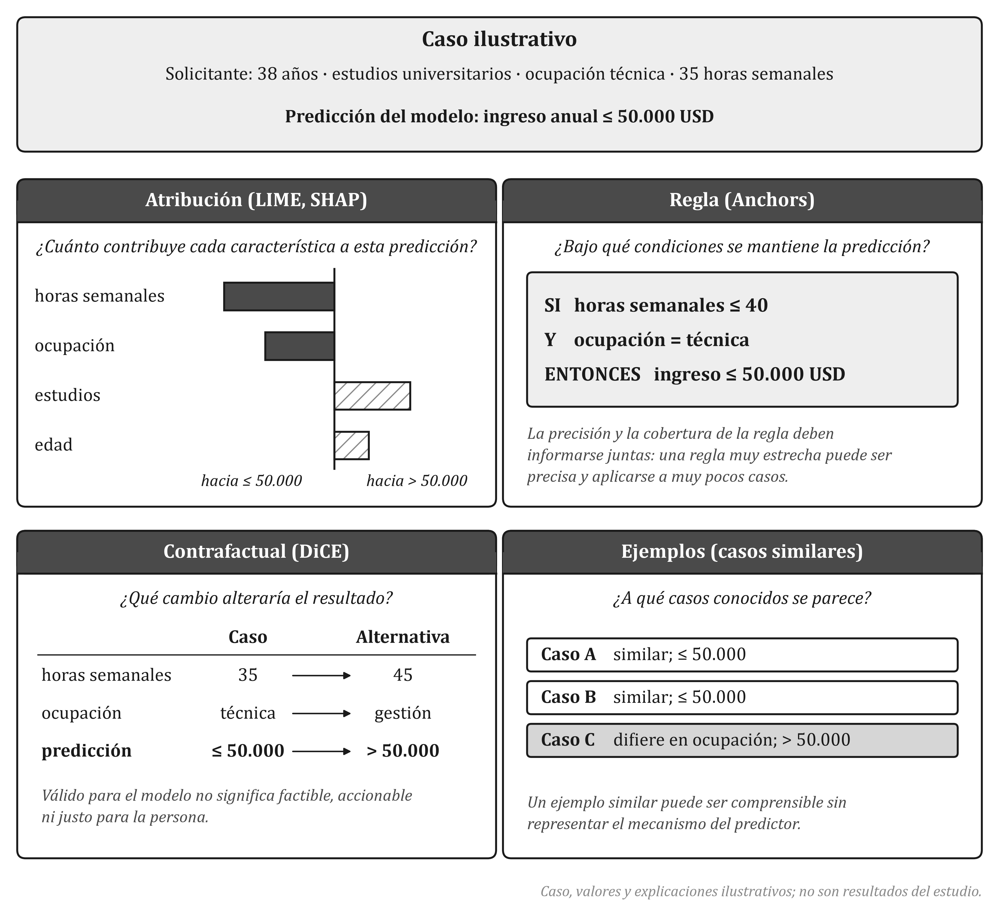
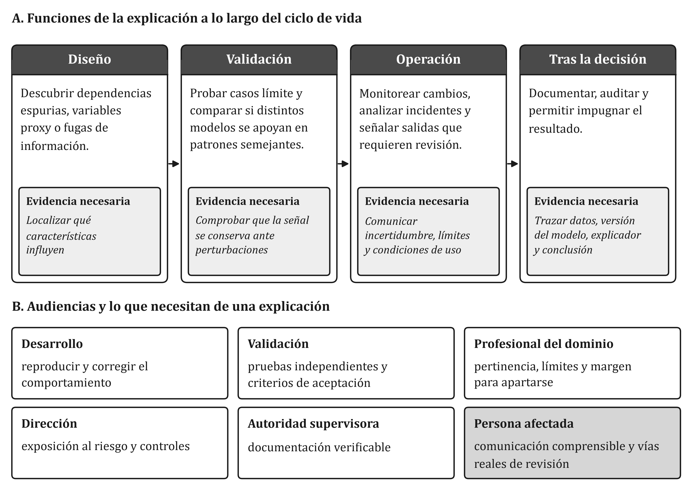

# Métodos de explicabilidad: LIME, SHAP, Anchors y DiCE

## Diversidad de objetos explicativos

Los métodos de explicabilidad agnósticos al modelo post-hoc no generan la misma clase de artefacto analítico. De acuerdo con las necesidades de la audiencia y la naturaleza de la tarea de auditoría, la respuesta explicativa se materializa en distintos **objetos explicativos**:

1. **Atribución numérica de características:** Vectores de ponderación real que asignan un valor numérico positivo o negativo a cada variable de entrada, representando su contribución neta a la predicción final.
2. **Reglas de decisión lógicas:** Conjuntos de condiciones condicionales de la forma $\text{SI } (x_1 > v_1) \land (x_2 = v_2) \text{ ENTONCES predicción } = Y$, que delimitan una región de suficiencia local.
3. **Explicaciones contrafactuales:** Modificaciones mínimas y realizables sobre los atributos de una instancia de entrada que alteran el resultado del modelo hacia una clase objetivo deseada (*¿Qué cambios mínimos debería realizar el usuario para ser aprobado?*).

La Figura 3 sintetiza la relación entre estos objetos explicativos y los cuatro algoritmos agnósticos evaluados en nuestro benchmark: LIME, SHAP, Anchors y DiCE. A continuación, se detalla la formulación técnica de cada uno de ellos.

## LIME: Explicaciones locales interpretables agnósticas al modelo

Propuesto por Ribeiro *et al.* (2016), **LIME** (*Local Interpretable Model-agnostic Explanations*) asume que, aunque un modelo de aprendizaje automático complejo $f(x)$ sea altamente no lineal en todo su dominio, su comportamiento en el entorno inmediato de una instancia específica $x$ puede aproximarse de forma efectiva mediante una función interpretable simple $g \in G$ (como un modelo lineal).

Para construir esta aproximación local, LIME genera un conjunto de perturbaciones sintéticas $z'$ en la vecindad de la instancia de interés $x$, evalúa la respuesta del modelo original $f(z')$ para cada muestra perturbada, y asigna un peso de proximidad $\pi_x(z)$ mediante un núcleo de distancia exponencial:

$$\pi_x(z) = \exp\left( -\frac{D(x, z)^2}{\sigma^2} \right)$$

donde $D(x, z)$ es la distancia (por ejemplo, euclidiana o de coseno) entre la instancia original $x$ y la perturbada $z$, y $\sigma$ es el ancho de banda del núcleo. La función explicativa $g$ se obtiene resolviendo el siguiente problema de optimización ponderado:

$$\xi(x) = \arg\min_{g \in G} \mathcal{L}(f, g, \pi_x) + \Omega(g)$$

donde $\mathcal{L}(f, g, \pi_x)$ representa la medida de infidelidad de la aproximación $g$ con respecto a $f$ ponderada por la distancia $\pi_x$, y $\Omega(g)$ es una penalización sobre la complejidad del modelo interpretable (como el número de características no nulas).

Para un estudiante o usuario no experto, la intuición de LIME equivale a tomar una fotografía macro de una montaña rocosa: vista desde lejos la montaña tiene una forma hiper-compleja e irregular, pero si nos acercamos a un metro cuadrado de su superficie, la pared parece casi completamente plana y puede describirse fácilmente con una pendiente simple.

## SHAP: Explicaciones basadas en teoría de juegos cooperativos

Desarrollado por Lundberg y Lee (2017), **SHAP** (*SHapley Additive exPlanations*) unifica diversos métodos de atribución post-hoc bajo el marco matemático formal de los valores de Shapley, un concepto originario de la teoría de juegos cooperativos (Shapley, 1953).

En el contexto de XAI, la predicción del modelo complejo sobre una instancia $x$ se interpreta como el "pago" (*payout*) obtenido en un juego de colaboración, donde las características del dato de entrada actúan como los "jugadores" que cooperan para lograr dicho resultado. La atribución de Shapley $\phi_i$ asignada a la característica $i$ cuantifica el aporte marginal promedio de dicha variable sobre todas las posibles coaliciones o combinaciones de características $S \subseteq F \setminus \{i\}$:

$$\phi_i(x) = \sum_{S \subseteq F \setminus \{i\}} \frac{\vert S \vert ! (\vert F \vert - \vert S \vert - 1)!}{\vert F \vert !} \left[ f_x(S \cup \{i\}) - f_x(S) \right]$$

donde $F$ es el conjunto total de características y $f_x(S)$ representa la predicción esperada del modelo cuando únicamente las variables en la coalición $S$ están presentes o son observadas.

La fortaleza matemática distintiva de SHAP radica en que es el **único** método de atribución local que garantiza simultáneamente cuatro propiedades axiomáticas fundamentales:
1. **Eficiencia (Aditividad local):** La suma de las atribuciones de todas las características equivale a la diferencia entre la predicción local $f(x)$ y la predicción promedio base $\mathbb{E}[f(X)]$, es decir, $\sum_{i=1}^{\vert F \vert} \phi_i(x) = f(x) - \mathbb{E}[f(X)]$.
2. **Simetría:** Si dos características $i$ y $j$ contribuyen exactamente lo mismo a todas las coaliciones posibles, sus valores asignados son idénticos ($\phi_i = \phi_j$).
3. **Jugador nulo (Dummy):** Si una característica $i$ no altera la salida del modelo en ninguna coalición ($f_x(S \cup \{i\}) = f_x(S)$), su valor de Shapley es cero ($\phi_i = 0$).
4. **Monotonicidad (Consistencia):** Si la contribución marginal de una característica aumenta o se mantiene igual en un modelo alternativo, su valor atribuido no puede disminuir.

Para calcular estos valores en clasificadores agnósticos de caja negra, Lundberg y Lee introdujeron **KernelSHAP**, una estimación basada en regresión lineal ponderada mediante un núcleo de Shapley especializado que aproxima numéricamente la fórmula combinatoria de Shapley.

## Anchors: Reglas de decisión de alta precisión con garantías formales

A diferencia de los métodos de atribución continua como LIME y SHAP, **Anchors** (Ribeiro *et al.*, 2018) genera explicaciones basadas en reglas lógicas condicionales denominadas "anclas". Una regla $A$ se define como un conjunto de predicados booleanos aplicados sobre las características de entrada (por ejemplo, $\text{Edad} > 35 \land \text{Estado\_Civil} = \text{Casado}$).

El objetivo central de Anchors es garantizar que, mientras se cumplan las condiciones fijadas en la regla $A$, la predicción del modelo complejo permanezca invariante con una probabilidad extremadamente alta. Formalmente, una regla $A$ se considera un "ancla" válida para la instancia $x$ si cumple la siguiente restricción probabilística PAC (*Probably Approximately Correct*):

$$P\left( \text{prec}(A) \ge 1 - \gamma \right) \ge 1 - \delta$$

donde la precisión local $\text{prec}(A)$ mide la proporción de instancias perturbadas $z$ satisfechas por la regla $A$ que mantienen la predicción original $f(x)$:

$$\text{prec}(A) = \mathbb{E}_{z \sim D(z|A)} \left[ \mathbb{I}(f(x) = f(z)) \right]$$

aquí $D(z|A)$ es la distribución de perturbaciones condicionada a que se satisfaga la regla $A$, $\gamma$ es el margen de error permitido (por ejemplo, $\gamma = 0.05$ para una precisión del 95%), y $\delta$ representa el parámetro de confianza estadística.

Además de exigir alta precisión, el algoritmo busca maximizar la **cobertura** (*coverage*) de la regla, definida como la probabilidad de que una instancia aleatoria del espacio de entrada satisfaga las condiciones de $A$:

$$\text{cov}(A) = P_{z \sim D}(A(z) = 1)$$

Anchors utiliza un enfoque de búsqueda por haces (*beam search*) guiado por algoritmos de bandidos multi-brazo (*Multi-Armed Bandits*) para explorar eficientemente el espacio de reglas candidatas sin evaluar innecesariamente el clasificador original.

## DiCE: Generación de explicaciones contrafactuales diversas

Propuesto por Mothilal *et al.* (2020), **DiCE** (*Diverse Counterfactual Explanations*) aborda la explicabilidad desde la perspectiva de la causalidad computacional y la acción prescriptiva. En lugar de explicar por qué el modelo tomó una decisión pasada, un contrafactual responde a la pregunta accionable: *¿Cuál es el conjunto mínimo de cambios en los atributos de entrada que alteraría la predicción del modelo hacia la clase deseada $y^*$?*

Si denotamos como $x$ la instancia de entrada original y como $c$ una instancia contrafactual candidata, DiCE formula la búsqueda de contrafactuales mediante la minimización de una función de pérdida multiobjetivo que equilibra la validez del resultado, la proximidad en el espacio de características y la diversidad entre un conjunto de $k$ contrafactuales generados $\{c_1, c_2, \dots, c_k\}$:

$$\min_{c_1, \dots, c_k} \frac{1}{k} \sum_{i=1}^k \mathcal{L}_{loss}(f(c_i), y^*) + \frac{\lambda_1}{k} \sum_{i=1}^k \text{dist}(x, c_i) - \lambda_2 \text{dpp}(c_1, \dots, c_k)$$

donde:
* $\mathcal{L}_{loss}(f(c_i), y^*)$ es la pérdida de clasificación (por ejemplo, error cuadrático medio o entropía cruzada) que penaliza la distancia entre la predicción sobre el contrafactual $f(c_i)$ y la clase objetivo $y^*$.
* $\text{dist}(x, c_i)$ es una métrica de distancia normalizada entre la instancia original y la contrafactual (combinando distancia de Manhattan para características continuas y distancia de Hamming para categóricas) para garantizar que los cambios sugeridos sean mínimos y realistas.
* $\text{dpp}(c_1, \dots, c_k)$ representa una métrica de diversidad basada en Procesos de Determinantes Puntos (*Determinantal Point Processes*, DPP), la cual promueve que los $k$ contrafactuales entregados exploren distintas vías de modificación (por ejemplo, una opción basada en aumentar el nivel educativo versus una opción basada en modificar el capital invertido).

## Trade-offs operacionales entre métodos

Ningún método de explicabilidad es universalmente superior a los demás en todas las dimensiones operacionales. La elección de un explicador implica aceptar compromisos estructurales de diseño (*trade-offs*):

Como se resume en la Figura 5, mientras que SHAP proporciona la mayor rigurosidad axiomática y fidelidad local, su costo de computación crece exponencialmente con la dimensionalidad de las características. LIME ofrece una velocidad de procesamiento superior a costa de una menor estabilidad estocástica. Anchors otorga reglas intuitivas e inalterables pero con coberturas locales acotadas, y DiCE entrega prescripciones altamente accionables pero requiere optimizaciones numéricas complejas sobre el espacio de entradas.
