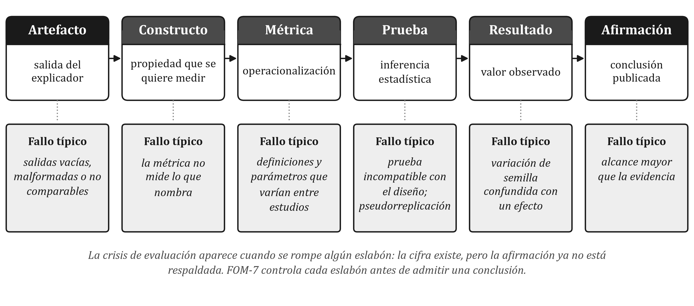
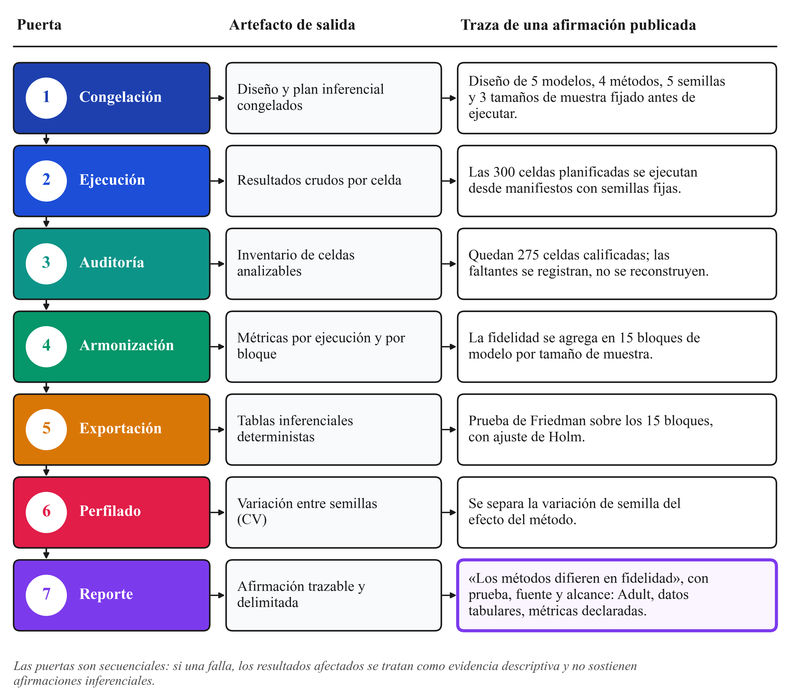

# Crisis de evaluación en XAI

## La crisis de confiabilidad en la explicabilidad post-hoc

A pesar del rápido crecimiento en el despliegue de explicadores post-hoc agnósticos en sectores industriales y académicos, la comunidad científica ha documentado una profunda "crisis de evaluación" que pone en duda la validez incondicional de estas herramientas (Krishna et al., 2022; Nauta et al., 2023; Agarwal et al., 2023). En aplicaciones reales de alta responsabilidad, se ha verificado que dos explicadores agnósticos ampliamente aceptados —tales como LIME y KernelSHAP— aplicados sobre exactamente el mismo conjunto de datos y la misma arquitectura de modelo predictivo producen rutinariamente justificaciones contrapuestas.

La Figura 6 sintetiza la anatomía de esta crisis. El núcleo del problema radica en que, a diferencia del aprendizaje supervisado estándar —donde las etiquetas de clase (*ground truth*) permiten calcular el error de generalización de forma directa—, en el ámbito de la explicabilidad no existe una "explicación verdadera" accesible u objetivable sobre cómo opera la mente algorítmica de una caja negra. Ante la ausencia de una referencia absoluta, los desarrolladores e investigadores de sistemas de XAI han recurrido frecuentemente a dos prácticas insostenibles:
1. **Inspecciones intuitivas subjetivas:** Evaluar la calidad de una explicación observando si los atributos destacados "tienen sentido" para el desarrollador, lo cual introduce sesgos de confirmación antropomórficos.
2. **Optimización de métricas endógenas aisladas:** Medir el éxito del explicador utilizando métricas diseñadas por los mismos autores del método, generando un sesgo de evaluación circular.

## Taxonomía de distorsiones y riesgos de confiabilidad

Las patologías operacionales que afectan a las explicaciones post-hoc agnósticas se pueden clasificar en cuatro categorías principales de riesgo:

1. **Efecto Rashomon en explicaciones:** Análogo al dilema estadístico formulado por Breiman (2001), ocurre cuando múltiples modelos explicativos locales $g_1, g_2, \dots, g_k$ construyen representaciones conceptuales radicalmente distintas pero obtienen niveles de infidelidad idénticos al aproximar las salidas del clasificador primario $f(x)$. Desde la perspectiva matemática, ambas explicaciones son igualmente "válidas" en términos de ajuste de error cuadrático; sin embargo, desde la perspectiva legal o clínica, entregar explicaciones contradictorias invalida la credibilidad de la auditoría.
2. **Muestreo fuera de distribución (*Out-of-Distribution / OOD Sampling*):** Para estimar la contribución de una variable, algoritmos como LIME y KernelSHAP generan muestras perturbadas alterando o enmascarando características individuales. En datasets tabulares con correlaciones complejas entre variables (por ejemplo, *Edad*, *Nivel Educativo*, *Años de Experiencia* e *Ingresos*), este proceso de muestreo independiente genera combinaciones físicamente o jurídicamente imposibles (por ejemplo, un individuo de 14 años con grado de doctorado y 25 años de aportaciones a la seguridad social). Evaluar el clasificador de caja negra sobre estas instancias OOD produce salidas aberrantes que distorsionan severamente los pesos de atribución resultantes.
3. **Inestabilidad e hipersensibilidad estocástica:** Modificaciones imperceptibles en los datos de entrada —incluso cambios de magnitud inferior a la precisión de medición del sensor o variable— o la simple alteración de la semilla del generador de números pseudoaleatorios en métodos basados en muestreo de Monte Carlo pueden provocar reordenamientos drásticos en el ranking de características importantes. Esta volatilidad resulta inaceptable en procesos judiciales o auditorías bancarias donde la consistencia es un requisito legal explícito.
4. **Vulnerabilidad a ataques adversariales y manipulación de explicaciones:** Investigaciones recientes han demostrado que las explicaciones post-hoc son altamente vulnerables a manipulación maliciosa. Slack et al. (2020) demostraron que es posible construir clasificadores "camuflados" (*scaffolding models*) que discriminan internamente por motivos de raza o género, pero que detectan cuándo están siendo perturbados por un explicador agnóstico (como LIME o SHAP), alterando su comportamiento local para devolver explicaciones perfectamente neutrales y equitativas durante las pruebas de auditoría.

La Figura 7 detalla visualmente esta taxonomía de riesgos y distorsiones. La presencia comprobada de estas patologías demuestra que emplear un explicador agnóstico sin auditar previamente sus métricas operacionales equivale a introducir una segunda caja negra no verificada dentro del proceso de supervisión.

## La necesidad de un protocolo holístico de auditoría

Para superar la crisis de evaluación, es imperativo abandonar la práctica de medir la explicabilidad mediante una sola métrica aislada. La evaluación de XAI exige un protocolo multicriterio, sistemático y computable que someta al explicador a pruebas rigurosas de fidelidad, estabilidad, parsimonia y viabilidad computacional. En la siguiente sección se introduce formalmente el protocolo **FOM-7**, diseñado específicamente para resolver esta necesidad operacional.
