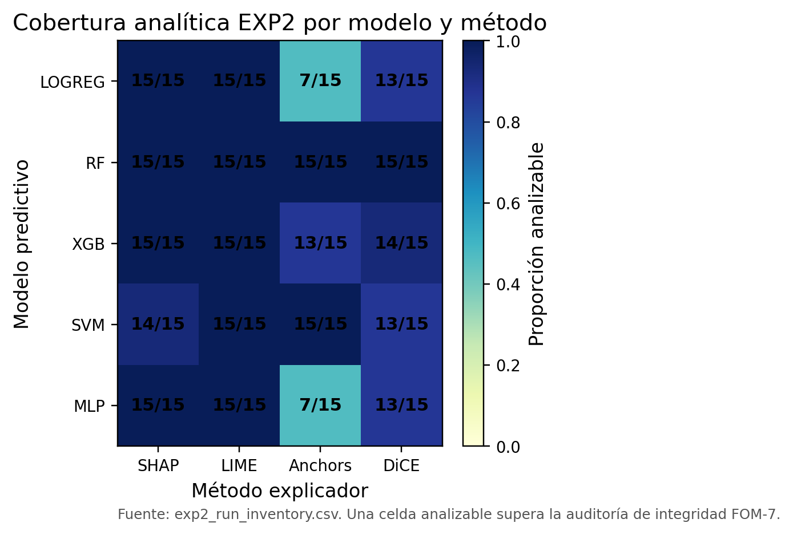

# Métodos evaluados y diseño del benchmark

Fuente inicial: `thesis/capitulo-2-fundamentos.qmd`, `tables/table_methods_comparison.md`, `tables/table_metrics.md` y `tables/table_results_summary.md`; `thesis/capitulo-1-marco-teorico.qmd` y `pub/fragments/paper_c_abstract_en.tex`.

## Panorama comparativo

Los cuatro métodos analizados representan familias distintas de explicación post-hoc agnóstica o parcialmente agnóstica al modelo. LIME produce sustitutos locales; SHAP genera atribuciones aditivas de características; Anchors formula reglas locales de alta precisión; DiCE construye ejemplos contrafactuales diversos. Esta heterogeneidad es metodológicamente decisiva porque cada método produce un objeto explicativo diferente y, por tanto, no debe evaluarse como si todos respondieran exactamente la misma pregunta. Una atribución responde cuánto contribuye una característica bajo una definición operacional de referencia; una regla responde bajo qué condiciones se conserva una predicción; un contrafactual responde qué cambios podrían alterar el resultado. Las revisiones sobre modelos de caja negra y métodos interpretables subrayan esta diversidad de salidas y advierten que la evaluación debe alinear método, artefacto, métrica y propósito antes de comparar resultados (Guidotti et al., 2018; Carvalho et al., 2019; Marcinkevičs & Vogt, 2023).

Las Figuras 2 y 3 presentaron el tipo de salida y la pregunta de cada familia; su función no es reducir los métodos a una jerarquía única, sino fijar el vocabulario con el que se leerán los resultados. FOM-7 exige que cada conclusión conserve unido el método, el objeto explicativo, la métrica, el contexto experimental y el alcance de la afirmación. Por ello, la comparación del capítulo debe entenderse como evaluación de perfiles: SHAP puede ser fuerte en fidelidad y estabilidad bajo las condiciones estudiadas; LIME puede ser eficiente y conciso, pero frágil ante perturbaciones; Anchors puede aportar reglas comunicables con restricciones de cobertura; DiCE puede producir alternativas contrafactuales útiles aunque no sea un método de atribución. La aplicación empírica del capítulo conecta esta distinción conceptual con la evidencia: no todos los métodos tuvieron la misma cobertura de celdas, no todos optimizan el mismo constructo y no todos deben leerse con el mismo estándar de comparación.

## LIME: sustitutos locales e inestabilidad potencial

LIME (*Local Interpretable Model-agnostic Explanations*) explica predicciones individuales mediante una aproximación local del modelo de caja negra. El procedimiento genera perturbaciones alrededor de una instancia, consulta el modelo original y ajusta un modelo interpretable, usualmente lineal, ponderando las observaciones según su proximidad a la instancia explicada (Ribeiro et al., 2016). Su intuición es atractiva: aunque el modelo global sea demasiado complejo para inspeccionarse directamente, una región cercana a una observación específica podría aproximarse con una frontera más simple. La explicación resultante identifica características con pesos positivos o negativos que describen la influencia local estimada en la predicción.

La fortaleza de LIME reside en su flexibilidad y en su bajo umbral comunicativo. Puede aplicarse a clasificadores diversos sin acceder a parámetros internos, produce salidas relativamente legibles y suele tener menor coste computacional que explicadores más exhaustivos. Sin embargo, esa misma flexibilidad introduce riesgos que no deben quedar ocultos bajo la etiqueta de "modelo agnóstico". La explicación depende del esquema de muestreo, de la definición del vecindario, del kernel de proximidad, del número de perturbaciones, de la selección de variables y del sustituto interpretable elegido. Si esos elementos cambian, la explicación puede variar de forma sustancial aun cuando la instancia y el modelo base sean los mismos. Por ello, no basta con afirmar que una explicación LIME es interpretable porque utiliza un modelo lineal; debe verificarse si ese sustituto aproxima de manera adecuada el comportamiento local bajo condiciones documentadas (Ribeiro et al., 2016; Guidotti et al., 2018).

Esta sensibilidad conecta con una preocupación más amplia sobre confiabilidad de explicaciones post-hoc. Estudios recientes muestran que LIME puede producir narrativas plausibles y, aun así, ser inestable ante cambios razonables de perturbación o vulnerable a manipulaciones del proceso explicativo (Burger et al., 2023; Slack et al., 2020). Para FOM-7, LIME representa un caso ejemplar de método útil para exploración rápida y comunicación inicial, pero que exige controles explícitos de estabilidad, trazabilidad de parámetros y alcance local. En el caso empírico de este capítulo, LIME resulta, frente a SHAP, más barato y más conciso, pero muy inestable bajo semillas; la sección de aplicación empírica documenta ese perfil. Esa combinación lo vuelve útil en escenarios de latencia o explicación preliminar, pero problemático para auditoría, comparación entre instancias o decisiones de alto riesgo cuando se requiere consistencia explicativa.

## SHAP: atribución aditiva basada en valores de Shapley

SHAP (*SHapley Additive exPlanations*) interpreta una predicción como suma de contribuciones atribuibles a las características. Su fundamento proviene del valor de Shapley en teoría de juegos cooperativos, adaptado al problema de distribuir la salida de un modelo entre variables explicativas (Lundberg & Lee, 2017). La salida típica de SHAP es un vector de atribuciones local para una instancia, aunque esas atribuciones pueden agregarse para construir resúmenes globales, comparar subgrupos o analizar tendencias de importancia. Su influencia se debe a que ofrece un marco formal unificado para explicaciones aditivas, con propiedades axiomáticas que facilitan la lectura comparativa de contribuciones.

Esa formalización, sin embargo, no elimina las decisiones operativas. El conjunto de referencia, la forma de simular ausencia de características, la dependencia entre variables y la variante concreta del explicador condicionan el significado de las atribuciones. KernelSHAP conserva una orientación más general y agnóstica, pero puede requerir numerosas consultas al modelo; TreeSHAP aprovecha la estructura de modelos basados en árboles para calcular atribuciones de forma más eficiente. La literatura sobre tractabilidad recuerda que calcular explicaciones SHAP exactas puede ser difícil o inviable para clases amplias de modelos, lo que obliga a registrar cuándo se trabaja con aproximaciones y qué compromisos introducen (Van den Broeck et al., 2022). Por tanto, "usar SHAP" no describe por sí solo una configuración experimental suficiente: deben especificarse variante, modelo base, conjunto de referencia, estrategia de aproximación y coste de cómputo.

El carácter formal de SHAP también puede inducir una lectura excesivamente fuerte si se confunden atribuciones operacionales con causalidad. Los valores SHAP distribuyen una salida del modelo bajo supuestos definidos; no prueban por sí mismos que una característica cause un resultado en el mundo ni que una intervención sobre ella produzca el cambio esperado. En este capítulo, SHAP se trata como una herramienta de atribución técnicamente robusta, pero su evidencia se mantiene dentro del alcance del benchmark. En el caso empírico, SHAP presenta el perfil más fuerte en fidelidad y estabilidad, con un coste que depende de la variante del explicador y de la familia de modelo; la sección de aplicación empírica detalla ambos aspectos.

## Anchors: reglas locales de alta precisión

Anchors explica una predicción mediante reglas locales tipo si-entonces. La idea central es encontrar condiciones suficientes bajo las cuales el modelo mantiene la misma predicción con alta probabilidad (Ribeiro et al., 2018). A diferencia de LIME o SHAP, Anchors no produce principalmente pesos de características, sino reglas que delimitan una región de decisión. Esta diferencia cambia la pregunta explicativa: ya no se pregunta qué variable aporta más a una predicción, sino qué conjunto de condiciones ancla esa predicción dentro de un espacio local.

La fortaleza de Anchors es comunicativa. Una regla local puede resultar más legible que una lista de atribuciones, especialmente cuando la explicación se comunica a personas que razonan mediante condiciones, excepciones o umbrales. Sin embargo, la precisión de una regla debe interpretarse junto con su cobertura. Una regla extremadamente específica puede alcanzar alta precisión porque aplica a muy pocos casos; una regla más general puede cubrir una región más amplia, pero perder precisión. Esta tensión convierte a Anchors en un método que exige evaluación cuidadosa: precisión, cobertura, complejidad de regla y reproducibilidad deben reportarse de manera conjunta, porque ninguna de esas dimensiones equivale por sí sola a calidad explicativa (Ribeiro et al., 2018; Guidotti et al., 2018).

Anchors también muestra por qué la evaluación debe atender al formato de salida. Una regla tiene cardinalidad, condiciones, umbrales y cobertura; una atribución tiene pesos; un contrafactual tiene distancia, factibilidad y validez. Si el benchmark traduce todos esos objetos a una sola escala, corre el riesgo de medir más la conveniencia de la métrica que la calidad del método. Por ello, FOM-7 trata Anchors como evidencia condicional: útil cuando precisión y cobertura se reportan juntas, pero limitada cuando se compara directamente contra métodos de atribución. En el caso empírico, Anchors no produjo artefactos analizables en todas las celdas y obtuvo valores bajos en métricas diseñadas para atribuciones, con un coste alto y variable. Estos resultados no prueban que Anchors sea irrelevante, sino que su objeto explicativo queda parcialmente desalineado con métricas diseñadas para atribuciones continuas.

## DiCE: contrafactuales diversos y acción correctiva

DiCE (*Diverse Counterfactual Explanations*) genera ejemplos contrafactuales: instancias alternativas que, con cambios mínimos o controlados, producirían una predicción diferente (Mothilal et al., 2020). Su pregunta principal no es qué característica contribuyó más a la predicción actual, sino qué tendría que cambiar para obtener otro resultado. Esta orientación ubica a DiCE en una familia distinta de explicaciones, especialmente relevante para escenarios donde el usuario necesita explorar alternativas de acción, posibilidades de corrección o rutas de *recourse* frente a una decisión automatizada (Wachter et al., 2017; Karimi et al., 2022).

La evaluación de contrafactuales exige criterios adicionales. Un contrafactual debe ser válido respecto al modelo, cercano a la instancia original, diverso respecto a otras alternativas y, en muchos dominios, factible o accionable. La accionabilidad impone restricciones semánticas: no todas las características pueden modificarse, y no todos los cambios matemáticamente cercanos son realistas. Un aumento de edad, una modificación de origen familiar o una combinación incompatible de atributos pueden invertir una etiqueta en el modelo sin constituir una recomendación plausible para una persona. Por ello, una métrica de fidelidad tradicional puede ser insuficiente para evaluar DiCE si no se acompaña de criterios de proximidad, diversidad, plausibilidad y coherencia con el dominio (Mothilal et al., 2020; Karimi et al., 2022).

La tradición contrafactual también advierte que una explicación puede ser injustificada si se apoya en regiones poco plausibles del espacio de datos o si no respeta la estructura local del problema. FACE, por ejemplo, enfatiza contrafactuales factibles y accionables en regiones conectadas por datos observados, mientras que otras críticas señalan los peligros de contrafactuales post-hoc que satisfacen una condición formal pero no una condición práctica de uso (Poyiadzi et al., 2020; Laugel et al., 2019). Para FOM-7, esta tensión exige que DiCE no sea evaluado como si fuera simplemente un método de atribución. En el caso empírico, DiCE obtiene una fidelidad baja bajo métricas de atribución, una estabilidad intermedia, las explicaciones más concisas del benchmark y un coste alto. Esta combinación lo vuelve relevante para discutir la ausencia de un método universalmente dominante: puede ser menos adecuado para auditar importancias locales, pero más alineado con escenarios donde interesa explorar alternativas de acción.

## Fases experimentales

El diseño distingue dos cohortes de evidencia con funciones diferenciadas. La primera, EXP1, funciona como fase de calibración y reproducibilidad. Su propósito es verificar la implementación del pipeline, entrenar y congelar los artefactos de modelo compartidos por todos los explicadores en EXP2, y estimar la dispersión métrica bajo variación de semilla. EXP1 opera como una fase de control: permite observar si las métricas principales son suficientemente estables y si los modelos cumplen umbrales mínimos de desempeño, pero no sostiene las afirmaciones confirmativas principales.

La segunda cohorte, EXP2, constituye el benchmark primario. En esta fase se ejecuta el diseño factorial completo y se producen los artefactos que alimentan las pruebas estadísticas, los perfiles por método y las afirmaciones empíricas del capítulo. La separación entre EXP1 y EXP2 reduce la contaminación entre decisiones exploratorias y evidencia confirmatoria. Esta separación es importante porque, en evaluación XAI, los ajustes de configuración después de observar resultados pueden cambiar tanto las métricas como la interpretación de los métodos. FOM-7 convierte esta separación en una regla de admisibilidad: la calibración informa el diseño, pero la inferencia se formula sobre la cohorte confirmativa.

La función de EXP1 también es reproducible. En la tesis, esta fase establece que las métricas de calidad presentan coeficientes de variación inferiores al 9% bajo variación de semilla, mientras que el coste computacional exhibe mayor variabilidad, especialmente en configuraciones con KernelSHAP. Esta diferencia anticipa una tensión que recorre todo el capítulo: la calidad explicativa puede ser más estable que la latencia, y por tanto el coste debe reportarse como dimensión propia del perfil de método, no como simple dato de ingeniería.

## Conjunto de datos y modelos predictivos

El benchmark utiliza el conjunto UCI Adult Income, un problema tabular de clasificación binaria ampliamente utilizado en aprendizaje automático y evaluación XAI por su estructura heterogénea, su variable objetivo clara y la existencia de comparaciones externas. El conjunto contiene variables numéricas y categóricas asociadas con características demográficas, laborales y educativas, y la tarea consiste en predecir si el ingreso anual supera un umbral de 50,000 dólares (Becker & Kohavi, 1996). Su uso es pertinente para este capítulo porque permite evaluar explicadores post-hoc sobre un escenario tabular con transformaciones de preprocesamiento, variables correlacionadas y clases desbalanceadas de forma moderada.

El pipeline de preprocesamiento se aplica de forma determinista: partición estratificada, normalización de valores faltantes, codificación de variables categóricas, escalado de variables numéricas y persistencia del preprocesador ajustado. Las transformaciones se ajustan exclusivamente sobre el conjunto de entrenamiento para evitar fuga de datos. Este control es esencial porque los explicadores operan sobre el espacio transformado que consumen los modelos; si el preprocesamiento variara entre métodos, una diferencia atribuida al explicador podría provenir de diferencias de representación. Por ello, el preprocesador se trata como artefacto compartido y congelado.

Se consideran cinco familias de modelos: regresión logística, bosque aleatorio, XGBoost, máquina de vectores soporte (SVM) y perceptrón multicapa (MLP). Esta selección permite observar explicadores sobre fronteras de decisión lineales, basadas en árboles, con kernel y neuronales. La inclusión de bosque aleatorio sigue la tradición de modelos de ensamblado introducida por Breiman (2001), mientras que XGBoost y los modelos no lineales amplían la diversidad de mecanismos predictivos. El objetivo no es evaluar qué modelo predictivo es superior, sino someter los explicadores a familias de decisión con estructuras distintas y verificar si los perfiles XAI se mantienen bajo esa heterogeneidad.

## Diseño factorial EXP2

El benchmark primario adopta un diseño cruzado de cuatro factores: modelo, método XAI, semilla y tamaño de muestra. Los factores son los cinco modelos descritos, los cuatro métodos (SHAP, LIME, Anchors y DiCE), cinco semillas (42, 123, 456, 789, 999) y tres tamaños de muestra por estrato (50, 100 y 200). Cada celda produce un artefacto independiente de resultados. La variación de semilla permite analizar reproducibilidad, mientras que la variación de tamaño de muestra permite examinar la estabilidad de patrones bajo distintos volúmenes de evidencia local. Esta estructura cruzada evita que una comparación entre explicadores dependa de un único modelo, una única semilla o una única escala de muestra.

El producto de los cuatro factores, cinco modelos por cuatro métodos por cinco semillas por tres tamaños de muestra, da un diseño planificado de 300 celdas, pero el análisis confirmativo utiliza 275 celdas calificadas tras la auditoría FOM-7. Esta distinción entre diseño planificado y cobertura analítica es deliberada. Los artefactos faltantes o no armonizables no se reemplazan de forma sintética ni se ocultan en promedios globales; se registran como parte de la evidencia. SHAP y LIME alcanzan cobertura completa, DiCE conserva 68 de 75 celdas y Anchors 57 de 75, con impacto interpretativo específico para reglas y contrafactuales. La Figura 8 presenta esta cobertura analítica por modelo y método.

## Muestreo de instancias

Las instancias se seleccionan mediante muestreo estratificado por cuadrante de error: verdaderos positivos, verdaderos negativos, falsos positivos y falsos negativos. Esta estrategia evita evaluar los explicadores únicamente sobre aciertos del modelo y obliga a observar su comportamiento en regiones de decisión correctas e incorrectas. En un benchmark de explicabilidad, esta decisión es importante porque una explicación puede parecer razonable cuando el modelo acierta y resultar más difícil de interpretar cuando el modelo falla. Incluir falsos positivos y falsos negativos aproxima el diseño a escenarios de auditoría, donde los errores del modelo suelen ser tan relevantes como sus aciertos.

El tamaño nominal de una ejecución depende del número de instancias por cuadrante, aunque la disponibilidad real puede variar por modelo y estrato. En la tesis, el rango observado va de 27 a 800 instancias por ejecución, con mediana de 400. Esta variación no invalida el diseño porque la inferencia se realiza sobre agregados controlados, no sobre instancias tratadas como réplicas independientes. Además, la estratificación por cuadrante de error permite que cada explicador sea examinado en condiciones de decisión más ricas que una muestra aleatoria simple del conjunto de prueba.

## Configuración de explicadores

SHAP se ejecuta con la variante adecuada a cada modelo: TreeSHAP para bosque aleatorio y XGBoost, y KernelSHAP, una aproximación más general, para los demás. LIME utiliza su explicador para datos tabulares con parámetros congelados de muestreo, número de características y ancho de kernel. Anchors emplea reglas locales con umbral de precisión efectivo de 0.95. DiCE genera contrafactuales orientados a la clase opuesta, usando diferencias entre instancia original y contrafactual como base de importancia. Estas configuraciones deben interpretarse como parte del protocolo experimental. No se evalúan nombres abstractos de métodos, sino implementaciones concretas con parámetros específicos, artefactos registrados y límites conocidos.

La decisión de registrar configuraciones efectivas es crucial porque el nombre de un explicador no determina por sí solo la evidencia que produce. KernelSHAP y TreeSHAP difieren en coste y supuestos; LIME depende de perturbaciones y vecindario; Anchors depende de condiciones de búsqueda y umbral; DiCE depende de restricciones contrafactuales y del modo de generación. Por ello, el diseño empírico no compara etiquetas, sino ejecuciones protocolizadas. Cualquier conclusión posterior debe conservar esta configuración como parte de su alcance.

## Métricas primarias

El benchmark utiliza cinco métricas primarias, resumidas en la Tabla 1: fidelidad, estabilidad, parsimonia, brecha de fidelidad y coste computacional. La fidelidad mide la alineación entre importancias y efecto predictivo observado; la estabilidad mide similitud entre explicaciones bajo perturbaciones controladas; la parsimonia aproxima concisión mediante proporción de características activas; la brecha de fidelidad estima el cambio en la salida del modelo al enmascarar características principales; y el coste registra tiempo de ejecución por instancia explicada.

<!-- TABLA: table_metrics.md -->

Estas métricas se computan por instancia y se agregan a nivel de ejecución mediante media aritmética. La unidad inferencial no es la instancia aislada, sino la ejecución agregada y, para las pruebas globales, el bloque experimental. Esta jerarquía evita pseudorreplicación y mantiene coherencia entre el nivel donde se calcula una métrica y el nivel donde se sostiene una afirmación. Además, cada métrica conserva dirección e interpretación propias: fidelidad, estabilidad y brecha buscan valores mayores; parsimonia y coste se leen en sentido inverso. Una lectura multi-métrica evita confundir calidad explicativa con una única escala.

## Unidades de análisis

El análisis adopta una jerarquía explícita. A nivel de instancia se calculan métricas individuales. A nivel de ejecución se obtiene el promedio para una combinación de modelo, método, semilla y tamaño. A nivel de bloque, las pruebas Friedman consideran pares modelo-tamaño $(g,n)$, generando 15 bloques completos. Dentro de cada bloque, el valor de cada método es la media de sus semillas calificadas; las semillas no se cuentan como bloques ni como réplicas independientes. Esta jerarquía es el control principal contra la pseudorreplicación: muchas instancias explicadas dentro de una misma celda no equivalen a muchas réplicas independientes del método.

## Plan inferencial

Las diferencias globales entre métodos se evalúan mediante pruebas de Friedman y comparaciones post-hoc de Nemenyi sobre bloques completos. Esta elección es apropiada para comparar varios tratamientos sobre bloques relacionados y se apoya en la tradición de pruebas no paramétricas para comparación de clasificadores y métodos sobre diseños repetidos (Friedman, 1937; Demšar, 2006). Cuando Friedman rechaza la hipótesis nula, Nemenyi permite localizar diferencias de rangos entre métodos sin asumir normalidad fuerte de las métricas (Nemenyi, 1963).

La reproducibilidad se examina mediante coeficientes de variación en configuraciones replicadas, especialmente para distinguir señales estables de variación inducida por semilla.

El objetivo del plan inferencial no es producir un ranking universal de explicadores, sino determinar qué diferencias son defendibles bajo el diseño, con qué tamaño de efecto, sobre qué unidad de análisis y dentro de qué alcance empírico. Por ello, los resultados posteriores deben leerse como afirmaciones condicionadas: diferencias entre métodos sobre Adult Income, con cinco familias de modelos, cinco semillas, tres tamaños de muestra, métricas definidas y artefactos calificados por FOM-7.
