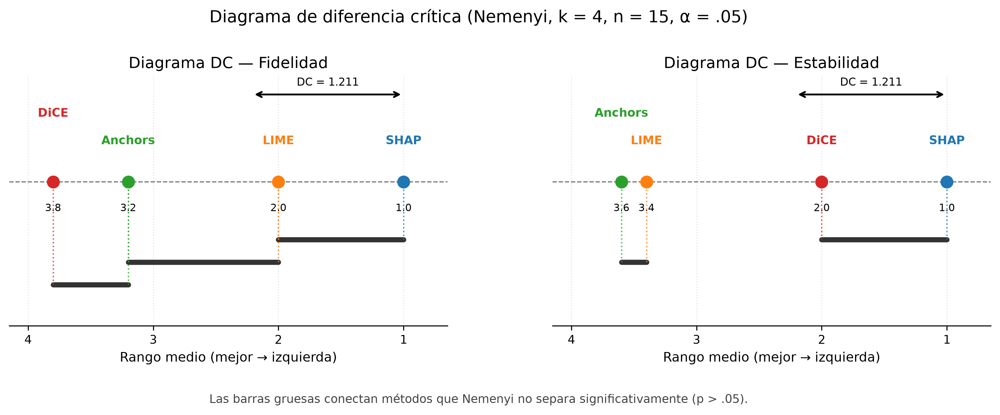
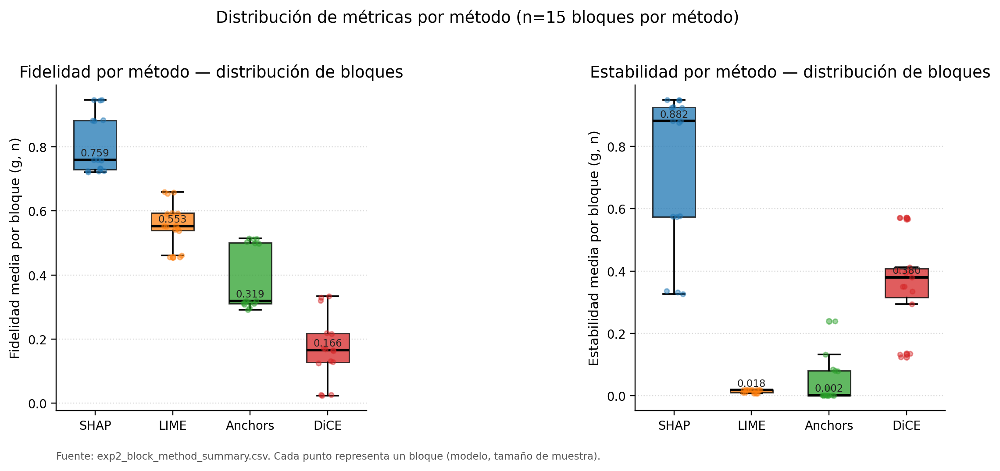
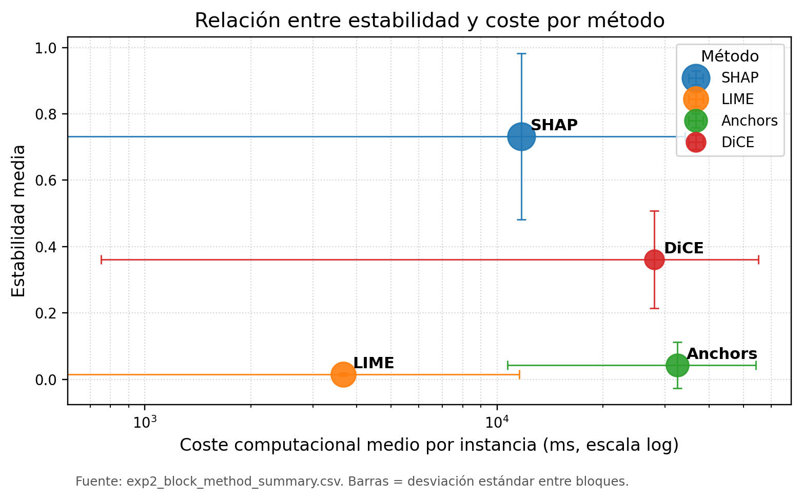
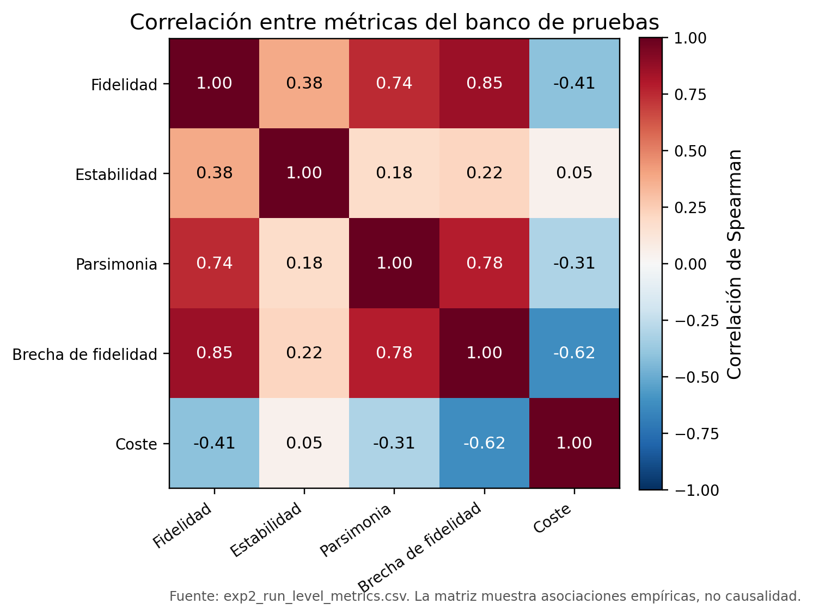
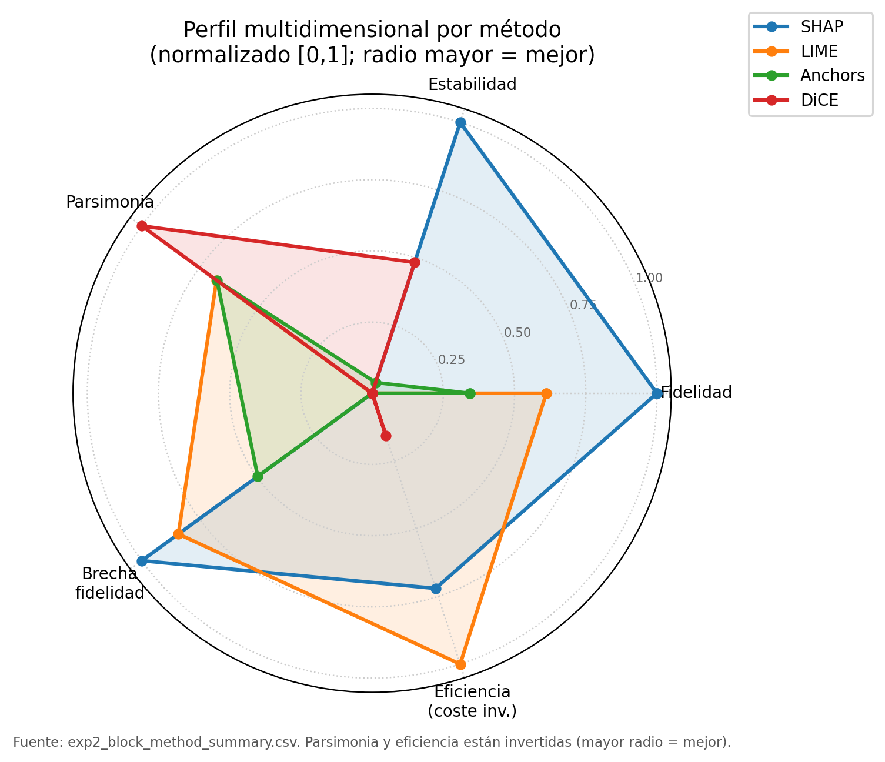

# Aplicación empírica: perfiles explicativos bajo FOM-7

Fuente inicial: `thesis/capitulo-4-resultados.qmd`, `tables/table_results_summary.md`, `tables/table_metrics.md` y `figures/figure_registry.md`.

## De resultados estadísticos a evidencia de capítulo

En un artículo empírico, esta sección podría presentarse como un bloque de resultados separado de la discusión. En este capítulo, su función es distinta: mostrar cómo FOM-7 transforma salidas de benchmarking en perfiles explicativos interpretables, trazables y metodológicamente delimitados. Por ello, las cifras se presentan junto con su lectura sustantiva. La pregunta no es solo qué método obtuvo el mejor valor en una métrica, sino qué enseña cada patrón sobre la evaluación auditable de explicaciones post-hoc.

Los resultados proceden del benchmark EXP2 sobre UCI Adult Income. El diseño planificado comprendía 300 celdas, resultantes de cinco modelos, cuatro métodos XAI, cinco semillas y tres tamaños de muestra. Tras la auditoría de artefactos de FOM-7, se obtuvieron 275 celdas calificadas. Las celdas no calificadas fueron excluidas antes de la inferencia confirmativa. Esta primera cifra ya es una conclusión metodológica: un benchmark auditable no empieza con la prueba estadística, sino con la calificación de qué evidencia puede entrar a la prueba.

La cobertura fue completa para SHAP y LIME, con 75 de 75 celdas cada uno. DiCE alcanzó 68 de 75 celdas y Anchors 57 de 75. Esta diferencia de cobertura no debe ocultarse ni tratarse como un pie de página técnico: forma parte de la evidencia sobre viabilidad operativa de los métodos y condiciona la precisión de las conclusiones para reglas y contrafactuales. Las celdas faltantes de Anchors, además, no se distribuyen al azar: se concentran en regresión logística y en el perceptrón multicapa, donde se perdió más de la mitad de las celdas. En esos modelos, las medias de Anchors descansan sobre menos semillas y pueden favorecer las configuraciones en las que el método converge. La tesis acota ese sesgo mediante un análisis de sensibilidad del umbral de precisión y lo describe como moderado, sin cambio en la posición relativa de Anchors. La Figura 1 documenta visualmente la cobertura analítica de EXP2 y debe leerse junto con la auditoría de artefactos de FOM-7.

## Evidencia global: diferencias reales, no ranking universal

El análisis global muestra diferencias estadísticamente significativas entre métodos en fidelidad y estabilidad. Para fidelidad, la prueba de Friedman produjo $\chi^2_F = 42.12$ sobre 15 bloques completos, con $p_{\mathrm{Holm}} = 1.51 \times 10^{-8}$ y $W = 0.936$. Este resultado rechaza la hipótesis nula de igualdad global entre métodos y muestra un patrón consistente: SHAP ocupa la primera posición de rango, seguido por LIME, Anchors y DiCE. La lectura inmediata es que, bajo esta operacionalización de fidelidad, las atribuciones SHAP se alinean mejor con los cambios observados en la salida del modelo.

Para estabilidad, la prueba de Friedman produjo $\chi^2_F = 40.68$, con $p_{\mathrm{Holm}} = 2.29 \times 10^{-8}$ y $W = 0.904$. El patrón no replica simplemente el orden de fidelidad: SHAP mantiene el perfil más fuerte, pero DiCE aparece como método relativamente estable en comparación con LIME y Anchors. Esta diferencia confirma que fidelidad y estabilidad no son constructos equivalentes. Una evaluación centrada en una única métrica habría perdido parte del fenómeno: los métodos no se distinguen solo por cuánto se alinean con el comportamiento local del modelo, sino también por cuánto varían sus explicaciones bajo perturbaciones y por qué tipo de objeto explicativo producen.

La implicación para un capítulo de libro es conceptual. El resultado estadístico no debe convertirse en la frase "SHAP gana". Debe convertirse en una lección sobre evaluación: cuando los métodos producen artefactos heterogéneos, las diferencias globales son útiles solo si se interpretan como perfiles condicionados por métrica, objeto explicativo y alcance experimental.

## SHAP y LIME: frontera calidad-coste

SHAP y LIME son los dos únicos métodos con cobertura completa, lo que permite compararlos en las mismas coordenadas experimentales. La tesis doctoral analiza ese contraste pareado en detalle (Herrera-Vásquez, 2026). Según esos resultados, aún no publicados ni revisados por pares, SHAP muestra una ventaja sistemática en fidelidad y en estabilidad, acompañada de una penalización de coste en la mayoría de los contextos; este capítulo remite a la tesis para sus estadísticos. La misma dirección se observa con la agregación por bloques de la prueba de Friedman. Un análisis exploratorio de la tesis, realizado después del análisis principal y fuera del protocolo congelado, encuentra que SHAP supera a LIME en fidelidad en 15 de 15 bloques ($p_{\mathrm{Holm}} = 3.05 \times 10^{-4}$); se informa solo como confirmación de la dirección, no como prueba adicional. En términos de auditoría técnica, esta regularidad importa más que una diferencia puntual de promedio: la ventaja aparece de forma sistemática a través de modelos y tamaños de muestra.

La parsimonia muestra el patrón inverso: SHAP es más denso y LIME más conciso. En coste, SHAP es en general más costoso, aunque el efecto depende de la familia de modelo: TreeSHAP es rápido sobre modelos de árboles y KernelSHAP es costoso sobre SVM y MLP. Esto define la frontera calidad-coste: SHAP aporta mayor calidad explicativa bajo las métricas evaluadas, mientras LIME conserva atractivo operativo cuando la latencia y la concisión son prioritarias. La consecuencia no es descartar LIME, sino delimitar su uso. LIME puede ser adecuado para exploración rápida o interfaces de baja latencia, pero su estabilidad casi nula bajo las condiciones evaluadas impide tratar sus salidas como evidencia robusta de auditoría.

## Cuatro perfiles explicativos

SHAP presenta el perfil global más equilibrado en el benchmark. Sus medias por bloque son 0.808 en fidelidad y 0.732 en estabilidad (Herrera-Vásquez & Herrero-Uceda, 2026). Sus medias por ejecución son 0.226 en parsimonia y 0.380 en brecha de fidelidad (Herrera-Vásquez, 2026). Este perfil lo posiciona como método fuerte para auditoría técnica cuando se requiere fidelidad y estabilidad. Sin embargo, su coste es heterogéneo. La media por ejecución va de 21 ms con TreeSHAP sobre XGBoost a 2,820 ms sobre Random Forest y 54,231 ms con KernelSHAP sobre SVM. Esa dispersión refleja también que el rótulo SHAP agrupa dos implementaciones: TreeExplainer, específico para modelos de árboles, en bosque aleatorio y XGBoost, y KernelExplainer, agnóstico al modelo, en las demás familias. Las diferencias de SHAP entre familias de modelo combinan así el efecto del modelo y el de la variante del explicador. Por tanto, la recomendación no debe formularse como superioridad universal, sino como preferencia condicionada por el modelo base y las restricciones operativas.

LIME aparece como método eficiente y parsimonioso. Su fidelidad media por bloque es 0.560 y su parsimonia media por ejecución, 0.085. Su coste medio por ejecución es bajo en la mayoría de las familias de modelo: 52 ms sobre MLP, 73 ms sobre regresión logística, 122 ms sobre XGBoost y 436 ms sobre bosque aleatorio. La excepción es SVM, con 17,620 ms. Frente a SHAP, esto le da ventaja de coste en la mayoría de los contextos, aunque no en todos: sobre XGBoost, TreeSHAP es más rápido que LIME. Estos valores sostienen su utilidad en escenarios donde se requiere explicación rápida, legible y de bajo coste. La limitación crítica es su estabilidad casi nula bajo las condiciones evaluadas: la media por bloque es 0.014. El valor de LIME dentro del capítulo es mostrar que una explicación plausible y barata no necesariamente es una explicación reproducible.

Anchors produce reglas locales de alta precisión, cualitativamente distintas a las atribuciones numéricas de LIME y SHAP. Su fortaleza está en la legibilidad condicional: una regla puede comunicar bajo qué condiciones se mantiene una predicción. En el benchmark, Anchors presenta cobertura incompleta y medias por bloque de 0.389 en fidelidad y 0.043 en estabilidad. Su coste es alto y variable, con una media por ejecución de 38,159 ms. Esta lectura debe ser prudente. No implica que Anchors sea inútil, sino que sus reglas requieren criterios propios de precisión, cobertura y aplicabilidad. Su comparación directa mediante métricas diseñadas para atribuciones debe conservar esta advertencia.

DiCE genera contrafactuales, no atribuciones de importancia. Por ello, su baja fidelidad bajo métricas de atribución no debe interpretarse como fallo absoluto. En la tesis, DiCE presenta medias por bloque de 0.170 en fidelidad y 0.361 en estabilidad, que es una estabilidad intermedia. Su parsimonia es muy baja (0.017) y su coste alto, con una media por ejecución de 28,209 ms. Este perfil sugiere que DiCE es más pertinente cuando el objetivo explicativo es explorar alternativas de acción o corrección, no cuando se busca auditar importancias locales. Su presencia en el benchmark ayuda a mostrar por qué FOM-7 evalúa perfiles y no rankings universales.

## Reproducibilidad como hallazgo, no solo control

La proposición de reproducibilidad se confirma parcialmente. La tesis la evalúa sobre un subconjunto replicado de EXP2: bosque aleatorio, 100 instancias por estrato y cinco semillas. En ese subconjunto, SHAP-fidelidad, SHAP-estabilidad y LIME-fidelidad muestran CV inferiores al umbral del 15%, con valores principales por debajo de 3%. Sobre el conjunto completo de ejecuciones calificadas, el CV agrupado de la fidelidad es de 11.4% para SHAP y de 12.0% para LIME, ambos por debajo del mismo umbral. La excepción es LIME-estabilidad. Su media en el subconjunto replicado es 0.018 con una desviación típica de 0.015, de modo que el CV relativo resulta muy elevado (Herrera-Vásquez, 2026). Esta excepción no invalida el protocolo. Revela, más bien, una propiedad del método bajo la configuración y el espacio de características evaluados, no una propiedad universal: cuando la estabilidad media es casi nula, pequeñas variaciones absolutas producen un CV relativo alto. La tesis observa, además, estabilidades altas para la misma configuración de LIME en conjuntos de datos con menos dimensiones. Ese resultado, aún no publicado, es compatible con una interacción entre el ancho del kernel y la dimensionalidad del espacio codificado de Adult Income, pero no la demuestra; la propia tesis la deja como pregunta abierta.

Este punto es importante para el argumento del capítulo. FOM-7 no solo confirma resultados; también ayuda a distinguir entre fallas del protocolo y propiedades problemáticas del método. Si una métrica varía porque el pipeline es inestable, el estudio pierde confiabilidad. Si una métrica varía porque el explicador produce salidas intrínsecamente inestables bajo condiciones controladas, el hallazgo es sustantivo. En este caso, la reproducibilidad funciona como lente interpretativa y no solo como requisito técnico.

## Síntesis del bloque empírico

Los resultados, resumidos en la Tabla 4, sostienen tres conclusiones de alcance delimitado. Primero, existen diferencias globales significativas entre métodos bajo el diseño EXP2. Segundo, SHAP ofrece el perfil más fuerte en fidelidad y estabilidad, especialmente cuando el objetivo es auditoría técnica. Tercero, no existe un método universalmente dominante: frente a SHAP, LIME suele ser más barato y más conciso, aunque DiCE produce las explicaciones más concisas del benchmark; Anchors produce reglas condicionales con límites de cobertura; DiCE aporta contrafactualidad y acción correctiva.

<!-- TABLA: table_results_summary.md -->

La frontera calidad-coste es el resultado interpretativo central. La selección de un método XAI debe depender del objetivo operativo: auditoría de alta fidelidad, explicación rápida, regla condicional o exploración contrafactual. FOM-7 permite que esa selección se base en evidencia trazable y no en preferencias anecdóticas. Para un capítulo de libro, esta es la contribución más relevante del bloque empírico: mostrar que el valor de los resultados no reside en una tabla aislada, sino en la manera en que el protocolo convierte diferencias métricas en criterios de uso.
